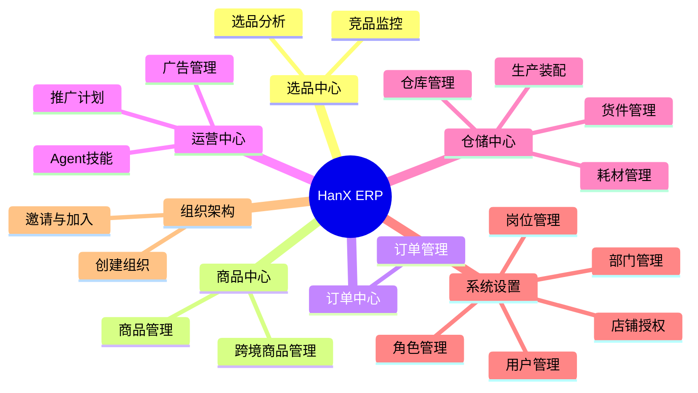
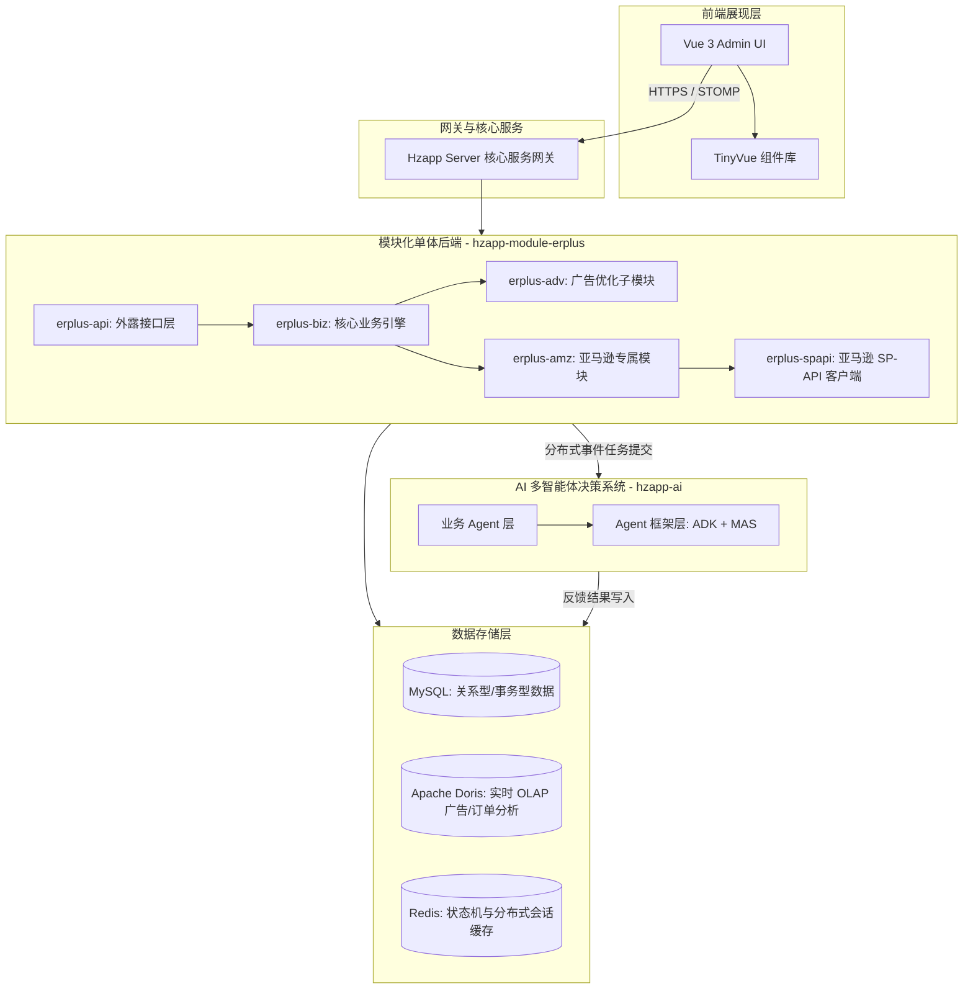
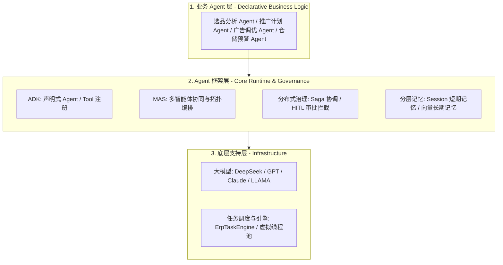
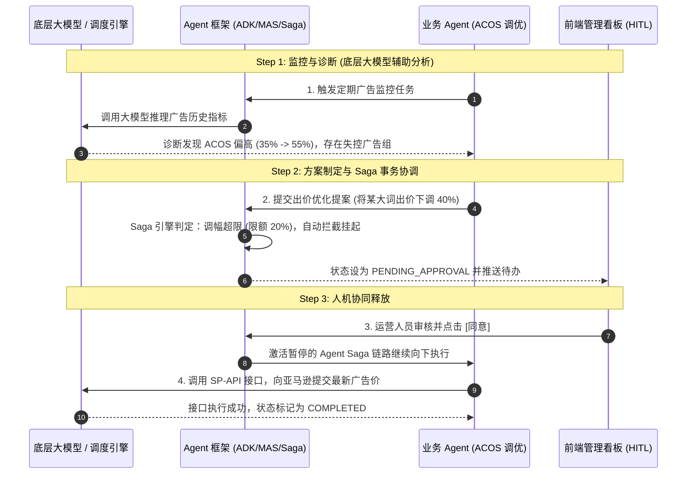

# HanX Marketing 跨境电商 ERP 系统

> [!NOTE]
> **HanX Marketing之HanX 跨境电商Erp系统** 是一套面向全球化电商卖家的智能化、全链路跨境电商运营与管理系统。基于现代化的微服务/模块化单体架构设计，集成卓越的 AI 多智能体（Multi-Agent System）运营决策流，打通从“选品-商品-广告-仓储-订单-组织”的跨境电商全周期业务闭环。

---

## 🚀 主要功能

### 1. 选品中心 (Selection Center)
*   **竞品监控**：全天候多维度监控竞品的 Listing 变动、价格走势、BSR 排名及评论变化，帮助卖家快速调整竞争策略。
*   **选品分析**：基于大数据进行品类市场容量、趋势评估及财务测算，支撑科学的高成功率选品决策。

### 2. 商品中心 (Product Center)
*   **商品管理**：标准化的本地商品库管理，支持多规格属性、条码管理及图片托管。
*   **跨境商品管理**：支持一键采集、多店铺一键同步发布、针对不同平台的本地化多语言 listings 翻译及文案优化。

### 3. 订单中心 (Order Center)
*   **订单管理**：聚合多店铺订单，支持多维度订单检索、自动合并与拆分、智能打单发货及售后退款处理。

### 4. 运营中心 (Operations Center)
*   **推广计划**：支持智能化的商品推广周期规划、预算拆分和效果全生命周期追溯。
*   **Agent 技能**：整合尖端的 AI Agent 工具箱，涵盖智能拓词、Listing 智能撰写、智能调价、Review 分析等高级运营技能。
*   **广告管理**：全方位管理亚马逊广告（SP、SB、SD、STV），提供高性能多维度的指标看板与智能调优引擎。

### 5. 仓储中心 (Warehouse Center)
*   **生产装配**：支持半成品与成品的装配单管理、多工序跟踪及成本精细化核算。
*   **货件管理**：FBA 货件（发货计划、发货贴标、箱唛生成）及第三方海外仓货件全流程跟踪管理。
*   **耗材管理**：包材、耗材库存储备监控，支持装配配料时耗材的自动扣减与采购预警。
*   **仓库管理**：多仓库（本地仓、海外仓、虚拟仓）管理，支持库存调拨、盘点、出入库流向精准控制。

### 6. 系统设置 (System Settings)
*   **店铺授权**：基于 OAuth 2.0 的安全平台授权机制（支持自授权与公共应用授权），一键接入店铺 API 权限。
*   **用户与权限**：精细到按钮级的多租户角色权限隔离，提供用户、角色、岗位、部门的组织关系链管理。

### 7. 组织架构 (Organization)
*   **创建组织**：支持多企业/多主体架构设计，一键生成独立的虚拟组织，数据物理/逻辑完全隔离。
*   **邀请/加入组织**：通过邀请链接/验证码实现成员快速入驻，高效协同办公。

---

## 🌐 支持平台

| 平台 | 图标 | 支持状态 | 接入能力 |
| :--- | :---: | :---: | :--- |
| **Amazon** | 🇺🇸 | **已支持** | 完整接入 SP-API 权限（订单、报告、FBA、广告调优） |
| **TikTok Shop** | 🎵 | <kbd>支持中</kbd> | 正在对接开放平台，支持半托管与自营店铺商品同步 |
| **Ozon** | 🇷🇺 | <kbd>支持中</kbd> | 接口对接中，重点支持俄罗斯本土化商品采集与订单回传 |
| **Walmart** | 🔵 | <kbd>支持中</kbd> | 多渠道配送与广告 API 对接筹备中 |

---

## 🏗️ 系统架构

系统采用 **“前后端分离 + 模块化单体 (Modular Monolith) 后端 + AI 总线驱动”** 的先进技术栈，保障了高内聚低耦合的同时，为大规模扩展保留了充足空间。

---

## 🤖 智能化 AI Agent 机制

HanX ERP 最大的技术创新在于集成了以 `hzapp-ai` 为基础的 **多智能体 (Multi-Agent System, MAS) 决策引擎**，系统采用清晰的**三层分层架构**，实现了业务逻辑、智能体运行机制和底层基础设施的完全解耦。

### 1. 智能体分层架构

#### 📂 1.1 业务 Agent 层 (Business Agent Layer)
面向跨境电商业务场景，负责高层业务逻辑的定义。将复杂的电商决策工作流转化为智能体的声明式配置，专注于解决特定业务问题。
*   **选品分析 Agent**：自动化抓取竞品和品类数据，分析市场趋势，生成财务测算与选品提案。
*   **广告调优 Agent**：实时诊断广告数据，监控 ACOS 指标，智能调节竞价和投放关键词。
*   **仓储/补货 Agent**：基于历史销量与供应链提前期，自动预测补货量并生成备货单。

#### 📂 1.2 Agent 框架层 (Agent Framework: ADK + MAS + 分布式任务/治理 + 分层记忆)
系统运行和协作的骨架，屏蔽底层的调度和大模型接口细节，为智能体提供基础运行环境。
*   **ADK (Agent Development Kit)**：声明式的 Agent 注册（`@Agent`）与 Tool 反射绑定（`@Tool`），提供规范的输入/输出规约转换。
*   **MAS (Multi-Agent System) 编排**：支持复杂的拓扑关系和事件驱动的协作流（如监控 ➔ 诊断 ➔ 决策 ➔ 执行的管道流），实现智能体之间的链式调用和并行调度。
*   **分布式任务与治理 (Distributed Saga & HITL)**：
    *   *异步持久化调度*：通过 `DistributedAgentPlugin` 拦截器，将耗时、长周期的 Agent 执行任务外化并提交至分布式任务引擎，以非阻塞的 Saga 模式异步处理，避免 Web 超时。
    *   *人机协同 (Human-in-the-loop, HITL)*：安全治理中心对高风险操作（如竞价降幅超 50%）进行自动拦截，将任务状态挂起为 `PENDING_APPROVAL`，经人工在运营看板确认（Approve）后释放并继续执行。
*   **分层记忆机制 (Layered Memory)**：
    *   *短期 Session 记忆*：保存在 Redis/内存中的单次会话上下文，快速读写，用于步骤级推理和状态流转。
    *   *长期向量记忆*：与组织/店铺绑定的历史策略偏好、运营规范和平台规则，通过 Embedding 向量化检索提供持续上下文背景。

#### 📂 1.3 底层支持层 (Underlying Support)
*   **大模型支持 (LLMs)**：整合业内主流大语言模型（如 Claude、DeepSeek、GPT-4 等），为其提供推理、语义理解和内容生成的核心大脑。
*   **任务调度引擎**：基于后端的分布式任务调度系统（`ErpTaskEngine`），利用 Java 21 虚拟线程支持大规模 Agent 的高并发、异步持久化任务调度与轮询管理。

---

### 💡 广告（AD）调优协同实例

以**亚马逊广告 ACOS 自动优化**为例，展示上述分层架构如何顺畅协同：

---

### 📅 `hanx-ai` 模块后续支持计划 (Roadmap)

为了进一步提升系统的自主性与可扩展性，`hanx-ai` 模块后续将分为**开源版本**与**定制版本**并行演进，以满足不同体量卖家与业务场景下的智能体调度需求：

#### 🔓 1. 开源版本：单机版 MAS 系统
*   **MAS 系统支持**：提供轻量级的单机版多智能体系统（MAS）运行时，支持单节点内多 Agent 协同与 Tool 调用。
*   **周期任务调度**：支持**小时维度**（Hour-level）的周期性任务自动触发与执行，适用于日常数据监控、Listing 定时体检等高频轻量场景。

#### 🔒 2. 定制版本：分布式 MAS 系统
*   **分布式 MAS 架构**：提供企业级分布式多智能体系统支持，具备多节点集群部署、状态故障转移（Failover）及高可用高吞吐的智能体治理能力。
*   **长周期 Agent 运行**：支持**天（Day）、周（Week）、月（Month）**维度的超长周期 Agent 持久化状态流转与背景记忆追踪，完美契合广告长周期诊断优化、月度供应链补货决策等复杂漫长任务流。

#### 🚀 3. 智能生态模块扩展 (Sub-system Extensions)
为了全方位赋能跨境电商运营，后续将推出两大核心智能子系统：

*   **HanX-GEO (生成式引擎优化系统)**：面向 AI 搜索时代的全新流量解决方案。
    *   *AI 搜索可见性优化*：分析产品在 ChatGPT、Claude、Perplexity、Google AI Overviews (SGE) 等主流生成式引擎中的曝光度与推荐概率。
    *   *智能内容渗透与诊断*：自动诊断 Listing 的 AI 友好度，分析竞品在 AI 推理上下文中的竞争优劣势，智能生成高曝光倾向的文案与品牌公信力内容。
*   **HanX-Affiliate (智能红人与联盟营销系统)**：一站式海外社媒与红人营销智能体。
    *   *精准红人画像与触达*：基于大语言模型与海外主流社媒（TikTok, Instagram, YouTube）数据进行红人画像分析，自动撰写并发送千人千面的个性化开发与合作邀请邮件。
    *   *效果追踪与 ROI 评估*：全链路联盟营销（Affiliate）追踪，自动分析红人带货视频/内容表现，结合转化率进行佣金结算推荐与投资回报分析。

---

### 💬 关注与交流 (Contact & Support)

如果您对 `hanx-ai` 的开发进展、跨境电商 AI 智能体最佳实践及企业定制方案感兴趣，欢迎关注我们的微信公众号：

  
   
  <b>扫码关注官方微信公众号，获取最新动态与技术支持</b>

