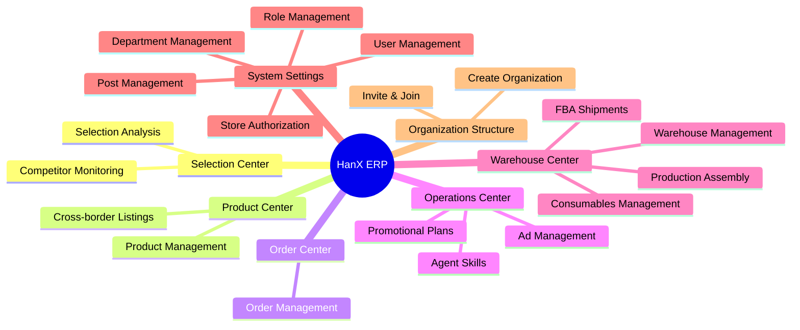
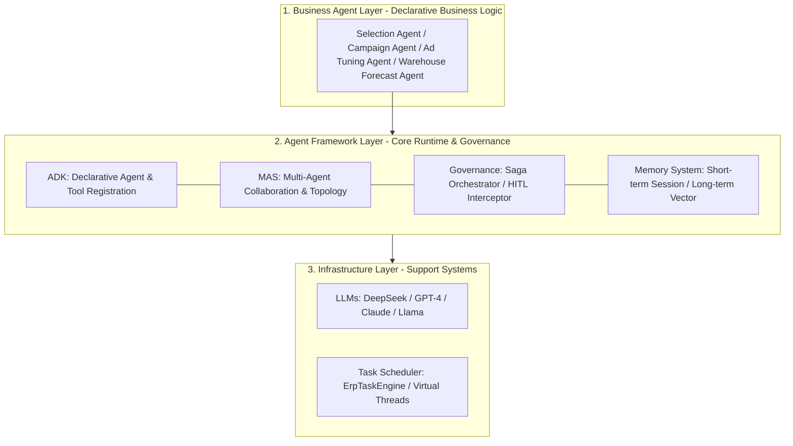
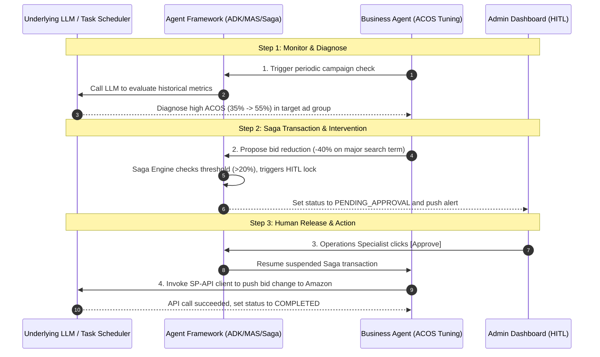

# HanX Marketing Global E-commerce ERP System

> [!NOTE]
> **HanX E-commerce ERP System** is an intelligent, full-link global e-commerce operations and management system designed for worldwide sellers. Built with a modern Modular Monolith architecture, it integrates a sophisticated AI Multi-Agent System (MAS) decision-making flow to close the loop on e-commerce operations: from selection and product hosting to ad tuning, inventory tracking, order processing, and multi-tenant organization.

---

## 🚀 Key Features

### 1. Selection Center
*   **Competitor Monitoring**: 24/7 multi-dimensional monitoring of competitors' listing changes, price movements, BSR rankings, and review updates to help sellers adapt rapidly.
*   **Selection Analysis**: Big-data driven analysis evaluating category market capacity, trend variations, and financial forecasts to enable high-success selection choices.

### 2. Product Center
*   **Product Management**: Standardized local master product catalog management with support for multi-spec attributes, barcodes, and image hosting.
*   **Cross-border Listings**: One-click product extraction, multi-store listings synchronization, localized multi-language translation, and description copywriting optimized by AI.

### 3. Order Center
*   **Order Management**: Aggregate multi-store orders with multi-dimensional search, automated merge/split rules, smart printing, shipping, and automated refunds/after-sales processing.

### 4. Operations Center
*   **Promotional Plans**: Smart campaign lifecycle planning, budget allocation, and marketing performance attribution tracking.
*   **Agent Skills**: An advanced AI Agent toolbox encompassing keyword harvesting, listing optimization, smart price tuning, review sentiment analysis, and more.
*   **Ad Management**: Full-lifecycle management of Amazon Ads (SP, SB, SD, STV) with high-performance real-time analytical dashboards and an auto-optimization engine.

### 5. Warehouse Center
*   **Production Assembly**: Manage bill of materials (BOM), assembly runs, multi-step process workflows, and exact product cost calculations.
*   **FBA Shipments**: Complete tracking of FBA shipments (creation, labelling, shipping stickers, box specs) and third-party overseas warehouses.
*   **Consumables Management**: Track and forecast packaging and shipping materials with automatic deductions during assembly and automated low-stock warnings.
*   **Warehouse Management**: Manage local, virtual, and overseas warehouses with support for inventory transfers, physical stocktaking, and precision flow controls.

### 6. System Settings
*   **Store Authorization**: Secure platform integration based on OAuth 2.0 (supporting both self-authorization and public developer apps) for fast API credential enrollment.
*   **User & Permissions**: Precision multi-tenant role isolation at the button level, managing users, roles, titles, and departments.

### 7. Organization Structure
*   **Create Organization**: Support multi-corporate structures with virtual organizations featuring strict physical/logical data isolation.
*   **Invite/Join**: Easily onboard employees and partners via link or secure invitation code.

---

## 🌐 Supported Platforms

| Platform | Flag | Status | Integration Scope |
| :--- | :---: | :---: | :--- |
| **Amazon** | 🇺🇸 | **Active** | Full SP-API integration (Orders, Reports, FBA, Advertising Tuning) |
| **TikTok Shop** | 🎵 | <kbd>Integrating</kbd> | Connecting open APIs for listing synchronization & merchant-fulfilled flows |
| **Ozon** | 🇷🇺 | <kbd>Integrating</kbd> | Developing APIs, prioritizing Russian translation and order synchronization |
| **Walmart** | 🔵 | <kbd>Integrating</kbd> | Preparing multichannel distribution & Ads API connections |

---

## 🏗️ System Architecture

The backend follows a **"Modular Monolith"** architectural pattern coupled with a **"Vue 3 admin UI"** and an **"AI Agent Bus"** for low-latency, scalable execution.

```mermaid
graph TD
    %% Presentation Layer
    subgraph Frontend [Presentation Layer]
        Vue[Vue 3 Admin UI] --> Tiny[TinyVue Components]
    end

    %% Gateway & Core
    subgraph Gateway [Gateway & Core]
        Server[Hzapp Server Gateway]
    end

    %% Modular Monolith
    subgraph Backend [Modular Monolith - hzapp-module-erplus]
        API[erplus-api: Interface Layer]
        BIZ[erplus-biz: Business Logic Engine]
        ADV[erplus-adv: Ad Optimization Submodule]
        AMZ[erplus-amz: Amazon Integration Module]
        SPAPI[erplus-spapi: Amazon SP-API Client]
        
        API --> BIZ
        BIZ --> ADV
        BIZ --> AMZ
        AMZ --> SPAPI
    end

    %% AI MAS
    subgraph AI_MAS [AI Multi-Agent System - hzapp-ai]
        BizAgent[Business Agent Layer]
        Framework[Agent Framework: ADK + MAS]
        BizAgent --> Framework
    end

    %% Storage Layer
    subgraph Storage [Storage Layer]
        MySQL[(MySQL: Core RDBMS & Transactions)]
        Doris[(Apache Doris: Real-time OLAP for Ads & Orders)]
        Redis[(Redis: State Machine & Distributed Cache)]
    end

    %% Connections
    Vue -->|HTTPS / STOMP| Server
    Server --> Backend
    Backend --> Storage
    Backend -->|Distributed Saga Task Event| AI_MAS
    AI_MAS -->|Write-back Results| Storage
```

---

## 🤖 Intelligent AI Agent Mechanism

At the core of HanX ERP is the **Multi-Agent System (MAS)** powered by `hzapp-ai`. Built as a **three-tier architecture**, it completely decouples business rules, agent state coordination, and underlying model/scheduling layers.

### 1. Layered Agent Architecture

#### 📂 1.1 Business Agent Layer
Deals with practical e-commerce scenarios. Complex decision-making workflows are translated into declarative configuration templates, allowing developers to focus purely on high-level operational strategies.
*   **Selection Agent**: Grabs competitor data, conducts product analysis, and produces exact margin forecasts.
*   **Ad Tuning Agent**: Identifies over-budget campaigns, monitors ACOS targets, and optimizes bids/keywords.
*   **Inventory Forecast Agent**: Predicts supply runs based on historic order rates and lead times.

#### 📂 1.2 Agent Framework Layer (ADK + MAS + Distributed Tasks + Layered Memory)
The engine governing how agents initialize, execute, and communicate.
*   **ADK (Agent Development Kit)**: Declarative agent (`@Agent`) and tool (`@Tool`) registration using annotations, resolving schema transitions automatically.
*   **MAS (Multi-Agent System) Orchestration**: Coordinates multi-agent workflows (e.g., Monitor ➔ Diagnose ➔ Decide ➔ Execute) using event-driven pipeline topologies.
*   **Distributed Tasks & Governance (Distributed Saga & HITL)**:
    *   *Asynchronous Persistence*: Outsources long-lived tasks through the `DistributedAgentPlugin` to a background engine using non-blocking Saga patterns to avoid HTTP timeouts.
    *   *Human-in-the-Loop (HITL)*: Safeguards automated changes (e.g., dropping a keyword bid by >50%) by intercepting and setting the state to `PENDING_APPROVAL`, awaiting manual release from the operational cockpit.
*   **Layered Memory**:
    *   *Short-term Session Memory*: Fast-access Redis/In-memory context for step-by-step reasoning steps.
    *   *Long-term Vector Memory*: Stores seller preference guidelines, historic rules, and marketplace restrictions via vector database embeddings.

#### 📂 1.3 Infrastructure Layer
*   **LLM Providers**: Integrates mainstream models (Claude, DeepSeek, GPT-4) to serve as the reasoning brain.
*   **Task Scheduler**: Driven by `ErpTaskEngine`, leveraging Java 21 Virtual Threads to coordinate massive parallel asynchronous execution and active status polling.

---

### 💡 Advertising (AD) Tuning Case

The sequence diagram below displays how the different layers interact to optimize an Amazon Ad campaign:

---

### 📅 `hanx-ai` Module Roadmap

To continuously expand autonomous execution capabilities, `hanx-ai` will evolve through two parallel editions tailored to different operational scales:

#### 🔓 1. Open Source Edition: Single-Instance MAS
*   **MAS Support**: A lightweight single-instance Multi-Agent System (MAS) supporting local agent coordination and tool calling.
*   **Periodic Tasking**: Supports **hour-level** scheduling for high-frequency checks like index health and basic keyword updates.

#### 🔒 2. Custom Edition: Distributed MAS
*   **Distributed Architecture**: Enterprise-ready multi-node clustering with high-throughput load balancing and transparent failover.
*   **Long-Running Agents**: Supports **day, week, and month-level** persistent states with advanced long-term vector memory tracking for monthly supply chain analysis and multi-week ad cycles.

#### 🚀 3. Sub-system Extensions
To provide comprehensive business coverage, the following specialized subsystems are on the roadmap:

*   **HanX-GEO (Generative Engine Optimization)**: A next-generation traffic acquisition engine.
    *   *AI Search Visibility*: Tracks product visibility and recommendation shares in search engines like ChatGPT, Claude, Perplexity, and Google AI Overviews.
    *   *AI Content Injection*: Audits listing pages for AI-readability, analyzes competitor placement trends in LLM lookups, and crafts search-optimized product copy.
*   **HanX-Affiliate (Intelligent Social & Affiliate Marketing)**: An automated outreach and influencer management hub.
    *   *Persona Analysis & Warm Outreach*: Employs social feeds (TikTok, Instagram, YouTube) to map matching creator profiles and autogenerate context-rich partnership emails.
    *   *Attribution & ROI Tracking*: Direct integration with affiliate tracking channels to evaluate creator performance and automatically compute commission payouts.

---

### 💬 Contact & Support

If you are interested in the development of `hanx-ai`, best practices for e-commerce AI Agents, or custom corporate editions, feel free to follow our WeChat Official Account:

  
   
  <b>Scan the QR Code to follow our official WeChat account for updates and technical support.</b>

