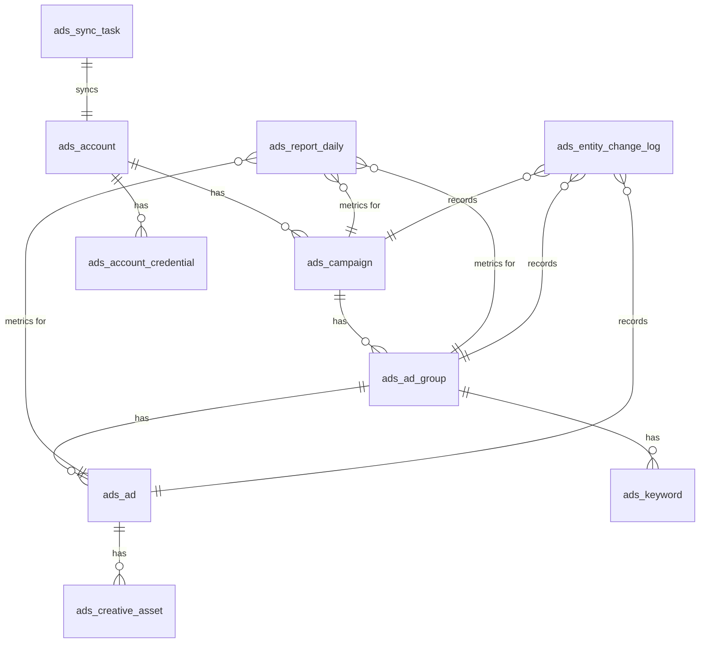
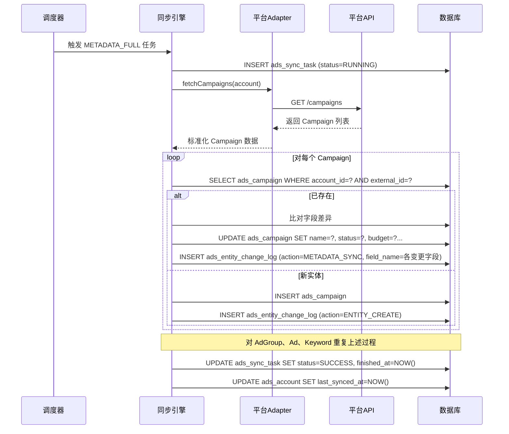
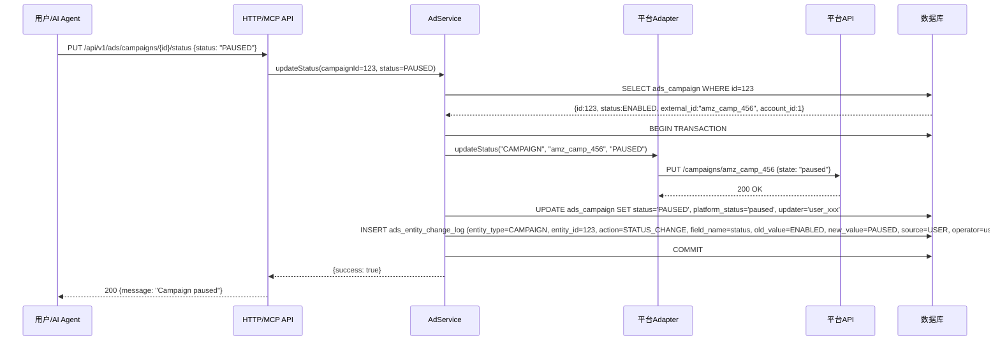
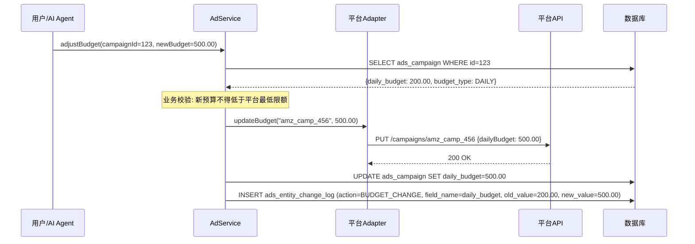
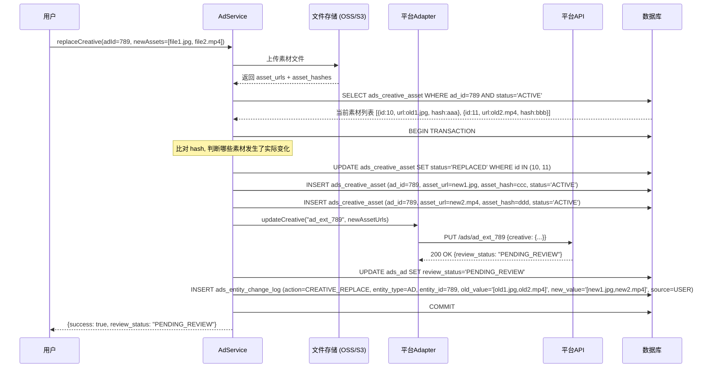
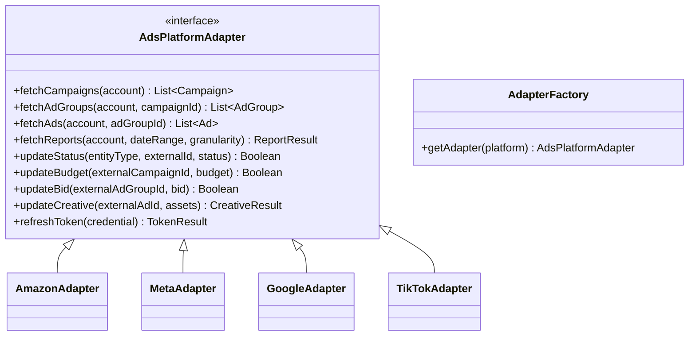

# 广告系统详细设计文档 (各模块细化)

## 1. 数据库设计 (Database Schema — 第三范式)

> [!IMPORTANT]
> 所有表遵循第三范式 (3NF)：消除传递依赖，将重复分组数据独立至关联表。JSON 扩展字段仅用于不参与查询和关联的平台私有元数据。

### 1.1 ER 关系总览

---

### 1.2 核心实体表 DDL

#### ① 广告账户 `ads_account`

| 字段                  | 类型         | 约束                                                           | 说明                                                        |
| :-------------------- | :----------- | :------------------------------------------------------------- | :---------------------------------------------------------- |
| `id`                  | BIGINT       | PK, AUTO_INCREMENT                                             | 自增主键                                                    |
| `tenant_id`           | BIGINT       | NOT NULL, INDEX                                                | 租户 ID (多租户隔离)                                        |
| `platform`            | VARCHAR(32)  | NOT NULL                                                       | 平台枚举: AMAZON / META / GOOGLE / TIKTOK                   |
| `external_account_id` | VARCHAR(128) | NOT NULL                                                       | 平台原始账户 ID                                             |
| `name`                | VARCHAR(255) |                                                                | 用户自定义显示名称                                          |
| `currency`            | VARCHAR(8)   | NOT NULL                                                       | 账户币种 (USD, CNY, EUR...)                                 |
| `timezone`            | VARCHAR(64)  |                                                                | 账户时区 (America/Los_Angeles)                              |
| `auth_status`         | TINYINT      | NOT NULL DEFAULT 1                                             | 授权状态 (1: 有效, 0: 失效)                                 |
| `last_synced_at`      | DATETIME     |                                                                | 上次同步完成时间                                            |
| `ext_config`          | JSON         |                                                                | 平台专属配置 (Amazon ProfileId, Google ManagerAccountId 等) |
| `creator`             | VARCHAR(64)  |                                                                | 创建人                                                      |
| `create_time`         | DATETIME     | NOT NULL DEFAULT CURRENT_TIMESTAMP                             | 创建时间                                                    |
| `updater`             | VARCHAR(64)  |                                                                | 最近修改人                                                  |
| `update_time`         | DATETIME     | NOT NULL DEFAULT CURRENT_TIMESTAMP ON UPDATE CURRENT_TIMESTAMP | 更新时间                                                    |
| `deleted`             | BIT(1)       | NOT NULL DEFAULT 0                                             | 软删除标记                                                  |

**UNIQUE INDEX**: `(platform, external_account_id)`

---

#### ② 账户凭证表 `ads_account_credential`（3NF 拆分：授权信息独立存储）

| 字段               | 类型         | 约束                                                           | 说明                                                         |
| :----------------- | :----------- | :------------------------------------------------------------- | :----------------------------------------------------------- |
| `id`               | BIGINT       | PK                                                             | 主键                                                         |
| `account_id`       | BIGINT       | NOT NULL, FK → ads_account.id                                  | 所属账户                                                     |
| `credential_type`  | VARCHAR(32)  | NOT NULL                                                       | 凭证类型: OAUTH2 / API_KEY / LWA                             |
| `access_token`     | TEXT         |                                                                | 加密后的 Access Token                                        |
| `refresh_token`    | TEXT         |                                                                | 加密后的 Refresh Token                                       |
| `token_expires_at` | DATETIME     |                                                                | Token 过期时间                                               |
| `client_id`        | VARCHAR(255) |                                                                | OAuth Client ID                                              |
| `client_secret`    | TEXT         |                                                                | 加密后的 Client Secret                                       |
| `ext_credential`   | JSON         |                                                                | 其他凭据 (如 Amazon Developer Token, Google Developer Token) |
| `create_time`      | DATETIME     | NOT NULL DEFAULT CURRENT_TIMESTAMP                             |                                                              |
| `update_time`      | DATETIME     | NOT NULL DEFAULT CURRENT_TIMESTAMP ON UPDATE CURRENT_TIMESTAMP |                                                              |

---

#### ③ 广告计划 `ads_campaign`

| 字段               | 类型          | 约束                                                           | 说明                                               |
| :----------------- | :------------ | :------------------------------------------------------------- | :------------------------------------------------- |
| `id`               | BIGINT        | PK                                                             | 主键                                               |
| `account_id`       | BIGINT        | NOT NULL, FK, INDEX                                            | 所属账户                                           |
| `external_id`      | VARCHAR(128)  | NOT NULL                                                       | 平台原始 Campaign ID                               |
| `name`             | VARCHAR(255)  | NOT NULL                                                       | 计划名称                                           |
| `campaign_type`    | VARCHAR(32)   |                                                                | 计划类型 (SP/SB/SD/SEARCH/DISPLAY/VIDEO...)        |
| `objective`        | VARCHAR(64)   |                                                                | 广告目标 (CONVERSIONS / TRAFFIC / AWARENESS)       |
| `status`           | VARCHAR(32)   | NOT NULL                                                       | 统一状态: ENABLED / PAUSED / ARCHIVED / REMOVED    |
| `platform_status`  | VARCHAR(64)   |                                                                | 原始平台状态原文                                   |
| `budget_type`      | VARCHAR(16)   |                                                                | 预算类型: DAILY / LIFETIME / CAMPAIGN_TOTAL        |
| `daily_budget`     | DECIMAL(18,4) |                                                                | 日预算                                             |
| `total_budget`     | DECIMAL(18,4) |                                                                | 总预算                                             |
| `start_date`       | DATE          |                                                                | 投放开始日期                                       |
| `end_date`         | DATE          |                                                                | 投放结束日期                                       |
| `bidding_strategy` | VARCHAR(32)   |                                                                | 出价策略类型 (MANUAL_CPC / AUTO_BID / TARGET_ROAS) |
| `ext_data`         | JSON          |                                                                | 平台扩展字段                                       |
| `synced_at`        | DATETIME      |                                                                | 上次从平台同步的时间                               |
| `creator`          | VARCHAR(64)   |                                                                |                                                    |
| `create_time`      | DATETIME      | NOT NULL DEFAULT CURRENT_TIMESTAMP                             |                                                    |
| `updater`          | VARCHAR(64)   |                                                                |                                                    |
| `update_time`      | DATETIME      | NOT NULL DEFAULT CURRENT_TIMESTAMP ON UPDATE CURRENT_TIMESTAMP |                                                    |
| `deleted`          | BIT(1)        | NOT NULL DEFAULT 0                                             |                                                    |

**UNIQUE INDEX**: `(account_id, external_id)`

---

#### ④ 广告组 `ads_ad_group`

| 字段              | 类型          | 约束                                                           | 说明                                                  |
| :---------------- | :------------ | :------------------------------------------------------------- | :---------------------------------------------------- |
| `id`              | BIGINT        | PK                                                             | 主键                                                  |
| `campaign_id`     | BIGINT        | NOT NULL, FK, INDEX                                            | 所属计划                                              |
| `account_id`      | BIGINT        | NOT NULL, INDEX                                                | 冗余字段, 优化跨层级查询                              |
| `external_id`     | VARCHAR(128)  | NOT NULL                                                       | 平台原始广告组 ID                                     |
| `name`            | VARCHAR(255)  | NOT NULL                                                       | 广告组名称                                            |
| `status`          | VARCHAR(32)   | NOT NULL                                                       | 统一状态                                              |
| `platform_status` | VARCHAR(64)   |                                                                | 原始平台状态                                          |
| `default_bid`     | DECIMAL(18,4) |                                                                | 默认出价                                              |
| `bid_strategy`    | VARCHAR(32)   |                                                                | 出价策略                                              |
| `targeting_type`  | VARCHAR(32)   |                                                                | 投放定向方式 (KEYWORD / AUTO / AUDIENCE)              |
| `ext_data`        | JSON          |                                                                | 其他定向参数 (年龄段/地域/兴趣/设备 等, 各平台差异大) |
| `synced_at`       | DATETIME      |                                                                |                                                       |
| `creator`         | VARCHAR(64)   |                                                                |                                                       |
| `create_time`     | DATETIME      | NOT NULL DEFAULT CURRENT_TIMESTAMP                             |                                                       |
| `updater`         | VARCHAR(64)   |                                                                |                                                       |
| `update_time`     | DATETIME      | NOT NULL DEFAULT CURRENT_TIMESTAMP ON UPDATE CURRENT_TIMESTAMP |                                                       |
| `deleted`         | BIT(1)        | NOT NULL DEFAULT 0                                             |                                                       |

**UNIQUE INDEX**: `(campaign_id, external_id)`

---

#### ⑤ 广告实体 `ads_ad`

| 字段               | 类型          | 约束                                                           | 说明                                             |
| :----------------- | :------------ | :------------------------------------------------------------- | :----------------------------------------------- |
| `id`               | BIGINT        | PK                                                             | 主键                                             |
| `ad_group_id`      | BIGINT        | NOT NULL, FK, INDEX                                            | 所属广告组                                       |
| `account_id`       | BIGINT        | NOT NULL, INDEX                                                | 冗余字段                                         |
| `external_id`      | VARCHAR(128)  | NOT NULL                                                       | 平台原始广告 ID                                  |
| `name`             | VARCHAR(255)  |                                                                | 广告名称                                         |
| `ad_format`        | VARCHAR(32)   |                                                                | 广告格式 (IMAGE / VIDEO / CAROUSEL / RESPONSIVE) |
| `status`           | VARCHAR(32)   | NOT NULL                                                       | 统一状态                                         |
| `platform_status`  | VARCHAR(64)   |                                                                | 平台原始状态                                     |
| `headline`         | VARCHAR(512)  |                                                                | 标题文案                                         |
| `description`      | TEXT          |                                                                | 描述文案                                         |
| `landing_page_url` | VARCHAR(1024) |                                                                | 落地页 URL                                       |
| `call_to_action`   | VARCHAR(64)   |                                                                | 行动号召按钮 (SHOP_NOW / LEARN_MORE)             |
| `review_status`    | VARCHAR(32)   |                                                                | 平台审核状态 (APPROVED / PENDING / REJECTED)     |
| `ext_data`         | JSON          |                                                                | 平台扩展                                         |
| `synced_at`        | DATETIME      |                                                                |                                                  |
| `creator`          | VARCHAR(64)   |                                                                |                                                  |
| `create_time`      | DATETIME      | NOT NULL DEFAULT CURRENT_TIMESTAMP                             |                                                  |
| `updater`          | VARCHAR(64)   |                                                                |                                                  |
| `update_time`      | DATETIME      | NOT NULL DEFAULT CURRENT_TIMESTAMP ON UPDATE CURRENT_TIMESTAMP |                                                  |
| `deleted`          | BIT(1)        | NOT NULL DEFAULT 0                                             |                                                  |

---

#### ⑥ 创意素材表 `ads_creative_asset`（3NF 拆分：从 ads_ad 的 JSON 数组独立出来）

| 字段               | 类型          | 约束                                                           | 说明                                |
| :----------------- | :------------ | :------------------------------------------------------------- | :---------------------------------- |
| `id`               | BIGINT        | PK                                                             | 主键                                |
| `ad_id`            | BIGINT        | NOT NULL, FK, INDEX                                            | 所属广告                            |
| `asset_type`       | VARCHAR(16)   | NOT NULL                                                       | 素材类型: IMAGE / VIDEO / HTML      |
| `asset_url`        | VARCHAR(1024) | NOT NULL                                                       | 素材文件 URL                        |
| `asset_hash`       | VARCHAR(64)   |                                                                | 素材指纹 (MD5/SHA256), 用于变更检测 |
| `width`            | INT           |                                                                | 像素宽度                            |
| `height`           | INT           |                                                                | 像素高度                            |
| `duration_seconds` | INT           |                                                                | 视频时长 (秒)                       |
| `sort_order`       | INT           | DEFAULT 0                                                      | 轮播顺序                            |
| `status`           | VARCHAR(16)   | DEFAULT 'ACTIVE'                                               | ACTIVE / REPLACED / DELETED         |
| `create_time`      | DATETIME      | NOT NULL DEFAULT CURRENT_TIMESTAMP                             |                                     |
| `update_time`      | DATETIME      | NOT NULL DEFAULT CURRENT_TIMESTAMP ON UPDATE CURRENT_TIMESTAMP |                                     |

---

#### ⑦ 关键词/投放目标表 `ads_keyword`（3NF 拆分：独立于广告组）

| 字段           | 类型          | 约束                                                           | 说明                                   |
| :------------- | :------------ | :------------------------------------------------------------- | :------------------------------------- |
| `id`           | BIGINT        | PK                                                             | 主键                                   |
| `ad_group_id`  | BIGINT        | NOT NULL, FK, INDEX                                            | 所属广告组                             |
| `external_id`  | VARCHAR(128)  |                                                                | 平台关键词 ID                          |
| `keyword_text` | VARCHAR(512)  | NOT NULL                                                       | 关键词文本                             |
| `match_type`   | VARCHAR(16)   | NOT NULL                                                       | 匹配类型: EXACT / PHRASE / BROAD       |
| `bid`          | DECIMAL(18,4) |                                                                | 自定义出价 (NULL 时继承广告组默认出价) |
| `status`       | VARCHAR(32)   | NOT NULL                                                       | 统一状态                               |
| `is_negative`  | BIT(1)        | DEFAULT 0                                                      | 是否为否定关键词                       |
| `create_time`  | DATETIME      | NOT NULL DEFAULT CURRENT_TIMESTAMP                             |                                        |
| `update_time`  | DATETIME      | NOT NULL DEFAULT CURRENT_TIMESTAMP ON UPDATE CURRENT_TIMESTAMP |                                        |
| `deleted`      | BIT(1)        | NOT NULL DEFAULT 0                                             |                                        |

---

### 1.3 绩效数据表

#### 每日报表 `ads_report_daily`

| 字段                 | 类型          | 约束                                                           | 说明                              |
| :------------------- | :------------ | :------------------------------------------------------------- | :-------------------------------- |
| `id`                 | BIGINT        | PK                                                             | 主键                              |
| `account_id`         | BIGINT        | NOT NULL, INDEX                                                | 关联广告账户                      |
| `entity_type`        | VARCHAR(16)   | NOT NULL                                                       | CAMPAIGN / ADGROUP / AD / KEYWORD |
| `entity_id`          | BIGINT        | NOT NULL                                                       | 内部实体 ID                       |
| `external_entity_id` | VARCHAR(128)  |                                                                | 平台原始实体 ID (用于同步比对)    |
| `report_date`        | DATE          | NOT NULL                                                       | 报表日期                          |
| `impressions`        | BIGINT        | DEFAULT 0                                                      | 展现                              |
| `clicks`             | BIGINT        | DEFAULT 0                                                      | 点击                              |
| `spend`              | DECIMAL(18,4) | DEFAULT 0                                                      | 花费                              |
| `conversions`        | INT           | DEFAULT 0                                                      | 转化数量                          |
| `conversion_value`   | DECIMAL(18,4) | DEFAULT 0                                                      | 转化总金额 / 销售额               |
| `video_views`        | BIGINT        | DEFAULT 0                                                      | 视频播放量 (视频广告)             |
| `reach`              | BIGINT        | DEFAULT 0                                                      | 触达人数 (Meta / TikTok)          |
| `synced_at`          | DATETIME      |                                                                | 数据写入/覆盖时间                 |
| `create_time`        | DATETIME      | NOT NULL DEFAULT CURRENT_TIMESTAMP                             |                                   |
| `update_time`        | DATETIME      | NOT NULL DEFAULT CURRENT_TIMESTAMP ON UPDATE CURRENT_TIMESTAMP |                                   |

**UNIQUE INDEX**: `(account_id, entity_type, entity_id, report_date)` — 防止重复写入，同时支持 UPSERT。

---

### 1.4 操作与审计表

#### 实体变更日志 `ads_entity_change_log`

| 字段          | 类型         | 约束                               | 说明                                         |
| :------------ | :----------- | :--------------------------------- | :------------------------------------------- |
| `id`          | BIGINT       | PK                                 | 主键                                         |
| `account_id`  | BIGINT       | NOT NULL, INDEX                    | 关联账户                                     |
| `entity_type` | VARCHAR(16)  | NOT NULL                           | CAMPAIGN / ADGROUP / AD / KEYWORD / CREATIVE |
| `entity_id`   | BIGINT       | NOT NULL, INDEX                    | 内部实体 ID                                  |
| `action`      | VARCHAR(32)  | NOT NULL                           | 操作类型 (见下文枚举)                        |
| `field_name`  | VARCHAR(64)  |                                    | 变更字段 (如 status, daily_budget, bid)      |
| `old_value`   | TEXT         |                                    | 变更前的值                                   |
| `new_value`   | TEXT         |                                    | 变更后的值                                   |
| `source`      | VARCHAR(16)  | NOT NULL                           | 变更来源: PLATFORM_SYNC / USER / AI_AGENT    |
| `operator`    | VARCHAR(64)  |                                    | 操作人 (用户名或 AI Agent ID)                |
| `request_id`  | VARCHAR(128) |                                    | 关联的平台 API 请求 ID (用于追溯)            |
| `remark`      | VARCHAR(512) |                                    | 备注                                         |
| `create_time` | DATETIME     | NOT NULL DEFAULT CURRENT_TIMESTAMP |                                              |

**`action` 枚举**:
`STATUS_CHANGE` | `BUDGET_CHANGE` | `BID_CHANGE` | `CREATIVE_REPLACE` | `TARGETING_CHANGE` | `METADATA_SYNC` | `ENTITY_CREATE` | `ENTITY_DELETE`

---

#### 同步任务表 `ads_sync_task`

| 字段               | 类型         | 约束                                                           | 说明                                                                   |
| :----------------- | :----------- | :------------------------------------------------------------- | :--------------------------------------------------------------------- |
| `id`               | BIGINT       | PK                                                             | 主键                                                                   |
| `account_id`       | BIGINT       | NOT NULL, FK, INDEX                                            | 关联账户                                                               |
| `task_type`        | VARCHAR(32)  | NOT NULL                                                       | 任务类型: METADATA_FULL / METADATA_INCR / REPORT_DAILY / TOKEN_REFRESH |
| `status`           | VARCHAR(16)  | NOT NULL                                                       | PENDING / RUNNING / SUCCESS / FAILED / PARTIAL                         |
| `platform_job_id`  | VARCHAR(128) |                                                                | 平台报表 Job ID (异步报表场景)                                         |
| `date_range_start` | DATE         |                                                                | 报表起始日期                                                           |
| `date_range_end`   | DATE         |                                                                | 报表结束日期                                                           |
| `retry_count`      | INT          | DEFAULT 0                                                      | 已重试次数                                                             |
| `max_retries`      | INT          | DEFAULT 3                                                      | 最大重试次数                                                           |
| `error_message`    | TEXT         |                                                                | 失败原因                                                               |
| `started_at`       | DATETIME     |                                                                | 开始执行时间                                                           |
| `finished_at`      | DATETIME     |                                                                | 完成时间                                                               |
| `create_time`      | DATETIME     | NOT NULL DEFAULT CURRENT_TIMESTAMP                             |                                                                        |
| `update_time`      | DATETIME     | NOT NULL DEFAULT CURRENT_TIMESTAMP ON UPDATE CURRENT_TIMESTAMP |                                                                        |

---

## 2. 核心业务流程推演

以下针对四个关键业务场景，详细描述数据流转和各表的变化。

### 2.1 流程一：广告元数据全量同步

**触发条件**：定时任务每 24 小时触发 / 用户手动点击"同步"。

**数据变化明细**：

| 步骤 | 涉及表                          | 操作                            | 关键字段                                                                       |
| :--- | :------------------------------ | :------------------------------ | :----------------------------------------------------------------------------- |
| 1    | `ads_sync_task`                 | INSERT                          | `task_type=METADATA_FULL, status=RUNNING`                                      |
| 2    | `ads_campaign`                  | UPSERT                          | 根据 `(account_id, external_id)` 唯一索引判断新增或更新                        |
| 3    | `ads_entity_change_log`         | INSERT (每个发生变化的字段一条) | `action=METADATA_SYNC, field_name=status, old_value=ENABLED, new_value=PAUSED` |
| 4    | `ads_ad_group`                  | UPSERT                          | 同上                                                                           |
| 5    | `ads_ad` / `ads_creative_asset` | UPSERT                          | 同步素材列表，按 `asset_hash` 检测变更                                         |
| 6    | `ads_sync_task`                 | UPDATE                          | `status=SUCCESS, finished_at=NOW()`                                            |

> [!NOTE]
> **本地存在但平台已删除的实体**：同步中未出现的 `external_id`，标记 `status=REMOVED`，并记录 `ENTITY_DELETE` 日志。不做物理删除。

---

### 2.2 流程二：广告状态变更 (暂停 / 启用)

**触发条件**：用户在控制台点击"暂停"或 AI Agent 调用 `update_ad_status` Tool。

**数据变化明细**：

| 步骤 | 涉及表                  | 操作   | 说明                                                                          |
| :--- | :---------------------- | :----- | :---------------------------------------------------------------------------- |
| 1    | `ads_campaign`          | SELECT | 校验实体存在、获取当前状态用于生成变更日志的 `old_value`                      |
| 2    | 平台 API                | PUT    | 先调用平台 API 确保远端成功后，再更新本地                                     |
| 3    | `ads_campaign`          | UPDATE | `status=PAUSED`, `updater` 记录操作人                                         |
| 4    | `ads_entity_change_log` | INSERT | `source=USER` (若由 AI 触发则 `source=AI_AGENT`, `operator=agent_budget_opt`) |

> [!WARNING]
> **先远端后本地** 原则：必须等待平台 API 调用成功后再更新本地数据库。若平台 API 调用失败，事务回滚，不更新本地状态，返回错误信息给调用方。

---

### 2.3 流程三：预算与出价修改

**触发条件**：用户手动修改 / AI Agent 调用 `adjust_campaign_budget` 或 `adjust_bid`。

**出价修改 (AdGroup / Keyword 级别)** 同理：

| 步骤 | 涉及表                          | 操作   | 说明                                                                        |
| :--- | :------------------------------ | :----- | :-------------------------------------------------------------------------- |
| 1    | `ads_ad_group` 或 `ads_keyword` | SELECT | 获取当前 `default_bid` / `bid`                                              |
| 2    | 平台 API                        | PUT    | 更新出价                                                                    |
| 3    | `ads_ad_group` / `ads_keyword`  | UPDATE | `default_bid=0.85` / `bid=1.20`                                             |
| 4    | `ads_entity_change_log`         | INSERT | `action=BID_CHANGE, field_name=default_bid, old_value=0.50, new_value=0.85` |

**业务规则**：

- 预算修改需校验平台最低限额 (如 Amazon SP 日预算最低 $1.00)
- 出价需在平台允许范围内 (通常 $0.02 ~ $1000.00)
- AI Agent 发起的修改需额外检查是否超过管理员配置的「单次调整幅度上限」(如最大调整 ±50%)

---

### 2.4 流程四：广告创意替换

**触发条件**：用户上传新素材替换现有广告的图片/视频。

**数据变化明细**：

| 步骤 | 涉及表                  | 操作   | 说明                                                                   |
| :--- | :---------------------- | :----- | :--------------------------------------------------------------------- |
| 1    | `ads_creative_asset`    | SELECT | 获取当前 ACTIVE 的素材列表                                             |
| 2    | `ads_creative_asset`    | UPDATE | 旧素材 `status` 从 `ACTIVE` 改为 `REPLACED` (保留历史记录, 不物理删除) |
| 3    | `ads_creative_asset`    | INSERT | 插入新素材记录, `status=ACTIVE`                                        |
| 4    | 平台 API                | PUT    | 上传新创意到平台                                                       |
| 5    | `ads_ad`                | UPDATE | `review_status=PENDING_REVIEW` (素材替换后平台通常需重新审核)          |
| 6    | `ads_entity_change_log` | INSERT | `action=CREATIVE_REPLACE`, 记录新旧素材列表                            |

> [!IMPORTANT]
> **素材不做物理删除**。旧素材通过 `status=REPLACED` 标记，保留完整的创意版本历史。这在广告效果回溯分析时（"之前那版图片的 CTR 是多少"）非常有价值。

---

## 3. 平台适配器设计 (Platform Adapter Pattern)

采用适配器模式抹平不同平台接口的差异。

### 3.1 请求调度与限流

- **Token Bucket**: 每个账号分配独立的令牌桶。
- **并发控制**: 针对 Amazon Ads 这种异步报表，维护 `ads_sync_task` 状态表，限制同时 RUNNING 的报表请求数。

---

## 4. 同步引擎架构 (Sync Engine)

| Job            | 频率 | 任务类型      | 描述                              |
| :------------- | :--- | :------------ | :-------------------------------- |
| Token 刷新     | 1h   | TOKEN_REFRESH | 刷新即将过期的 OAuth Token        |
| 元数据全量同步 | 24h  | METADATA_FULL | 拉取全部 Campaign/AdGroup/Ad 结构 |
| 绩效数据同步   | 4h   | REPORT_DAILY  | 拉取 T-0 和 T-1 的报表并 UPSERT   |

**数据一致性**：采用"覆盖写" (UPSERT) 策略更新 `ads_report_daily`，每次同步 `Today` 和 `Yesterday` 的数据。

---

## 5. MCP 接口与 AI 交互设计

### 5.1 接口契约 (AI Friendly)

Tool/MCP 接口应包含 `summary` 字段，直接返回人类可读的结论，而非纯 JSON。

### 5.2 安全性

- **Write Permission**: 关键写操作需在 MCP 层级配置 User Confirmation。
- **Audit Log**: 通过 `ads_entity_change_log` 表（`source=AI_AGENT`）记录所有 AI 发起的修改操作。
- **调整幅度限制**: AI Agent 单次预算/出价调整幅度不得超过管理员配置的阈值。

---

## 6. 后续步骤

1. 确认表结构后生成正式 MySQL DDL 脚本。
2. 逐个平台实现 Adapter。
3. 对外暴露 MCP Server 接入 AI Agent。
