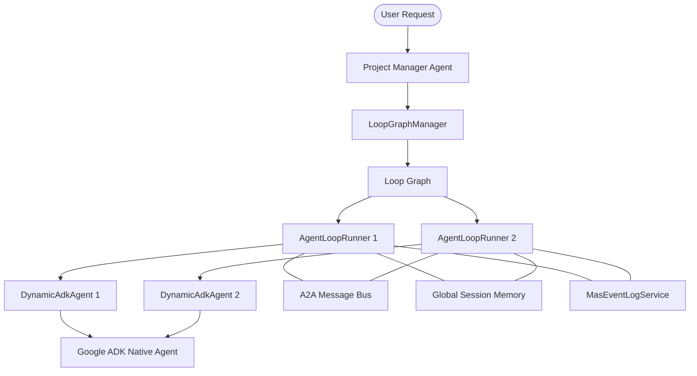

# MAS Architecture & Google ADK Integration Guide

This document outlines the architecture of the erplus Multi-Agent System (MAS) runtime and its integration with the Google Agent Development Kit (ADK).

## 1. System Architecture Overview

The erplus MAS is an event-driven, graph-based multi-agent execution engine. It is designed to orchestrate complex task workflows by coordinating specialized agents in a parallel, dependent graph.

### High-Level Architecture

---

## 2. Core Components

### 2.1 LoopGraphManager
Responsible for managing the execution of an agent dependency graph within a session.
- **Node Dispatching**: Tracks node statuses (`PENDING`, `RUNNING`, `SUCCESS`, `FAILED`) and starts nodes whose dependencies are satisfied.
- **Parallel Execution**: Uses a thread pool to execute multiple independent agent loops concurrently.

### 2.2 AgentLoopRunner
The lifecycle orchestrator for a single graph node. It implements the **Think-Plan-Execute-Review** loop:
1. **Think**: Internal state transition.
2. **Plan**: Task preparation.
3. **Execute**: Delegation to the `BaseAgent` (typically `DynamicAdkAgent`).
4. **Review**:
    - **Self-Review**: Internal assessment.
    - **Peer-Review** (Phase 9): If a `reviewerRole` is defined, it sends a `PROPOSAL` and waits for a `REVIEW` message from another agent via the `A2AMessageBus`.

### 2.3 A2A Message Bus
A Reactor-based, asynchronous message bus for inter-agent communication.
- **Protocols**: Supports `PROPOSAL`, `REVIEW`, `ACCEPT`, `REJECT`, `INFO`, `COMMAND` message types.
- **Concurrency**: Uses a `Replay` sink to handle race conditions where a response might be sent before the requester is ready to subscribe.

---

## 3. Google ADK Integration

The erplus MAS integrates with the **Google ADK (0.8.0)** via the `DynamicAdkAgent` bridge.

### 3.1 DynamicAdkAgent Bridge
This class wraps a native ADK `LlmAgent` and implements the `BaseAgent` interface.
- **Execution Mapping**: The `execute()` method maps erplus instructions and `LoopMemory` into ADK's `InvocationContext`.
- **Event Streaming**: It uses `adkNativeAgent.runAsync()` to stream ADK internal events (e.g., tool invocations) and logs them into the `MasEventLog`.
- **Memory Sync**: Extracts final text results from the ADK stream and updates the `LoopMemory`.

### 3.2 ADK Lifecycle vs. erplus Loop
| erplus Phase | ADK equivalent / Action |
| --- | --- |
| **Think/Plan** | Instruction augmentation based on Global Context. |
| **Execute** | `LlmAgent.runAsync()` with tools and system instructions. |
| **Review** | External peer-review logic (A2A) after ADK completion. |

---

## 4. Memory & Session Management

### 4.1 GlobalSessionMemory
A thread-safe, session-scoped key-value store.
- **Collision Strategies**: Supports `OVERWRITE`, `STRICT` (error on collision), and `MERGE` (recursive map merging) to ensure data integrity during parallel agent updates.

### 4.2 LocalLoopMemory
An isolation layer for individual agent loops. Changes are staged locally and merged into `GlobalSessionMemory` upon successful loop completion.

---

## 5. Observability & Debugging

### 5.1 MasEventLog
Captures a detailed timeline of the MAS execution:
- **Lifecycle Events**: `START`, `PHASE_CHANGE`, `DONE`, `ERROR`.
- **Agent Events**: `AGENT_START`, `AGENT_EVENT:ToolInvocation`, `AGENT_DONE`.
- **Collaboration Events**: `PROPOSAL_SENT`, `ACCEPTED`, `REJECTED`.
- **State Snapshots**: Full memory state captures at the end of each loop for visual playback in the Debug UI.

### 5.2 Persistence & Fault Tolerance
`MasCheckpointService` provides fault tolerance by recording task history and enabling resumption from the last stable checkpoint.
- **Checkpoint Points**: 
    - At start of `AgentLoopRunner`.
    - At end of execution (results, status, duration).
- **Recovery Logic**: `AgentLoopRunner` checks for existing `MasTaskHistoryDO` entries before execution. If a successful previous run is found (based on loop ID and session ID), it skips execution and populates the memory from the checkpoint.

---

## 6. Integration Best Practices

1. **Role Separation**: Define agents with discrete responsibilities (e.g., `Coder`, `Reviewer`, `Planner`).
2. **Granular Nodes**: Keep graph nodes focused to maximize parallelization and simplify recovery.
3. **Strict Review**: Use `reviewerRole` for critical output paths to ensure multi-agent consensus.
4. **Tool Instrumentation**: Always use the `eventLogService` within custom tools to maintain execution visibility.
