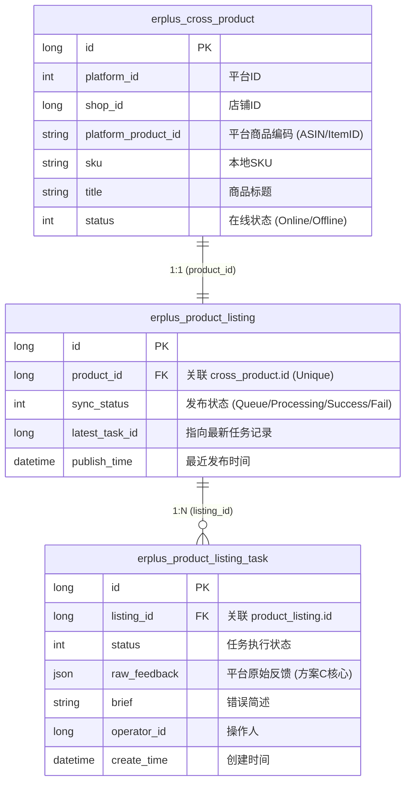

# 刊登同步与展示设计 (Listing Sync & Display Design)

## 目标 (Goals)
建立一套通用的刊登同步任务管理机制，实现商品从 ERP 发送到平台的全流程可追溯，并通过高效的方式在商品列表中展示同步状态与深度反馈信息。

## 业务流程 (Business Flow)
1.  **用户操作**：用户在商品列表或编辑页点击“保存并刊登”或“同步更新”。
2.  **任务创建**：后端执行通用业务逻辑校验后，在 `erplus_listing_task` 创建记录，状态设为 `QUEUING`（待处理）。
3.  **异步执行**：任务分发器将任务推送到对应平台的异步执行器（如 Amazon SP-API Executor）。
4.  **状态回写**：执行器调用平台接口后，将结果（Success/Fail/Warnings）异步回写到任务表的 `status` 和 `raw_feedback` 字段。
5.  **前端展示**：用户刷新商品列表，通过 API 聚合查询直接获取最新同步状态，点击即可查看详情。

## 系统架构 (Architecture)

### 数据建模 (Data Modeling)

#### 实体关系图 (ER Diagram)


#### 核心字段说明 (Core Fields)
- **sync_status (erplus_product_listing)**: 用于列表页快速过滤（如“发布失败”列表）。
- **raw_feedback (erplus_product_listing_task)**: **JSON类型**。存储平台返回的完整报文。例如：
  ```json
  {
    "errors": [{"code": "MISSING_ATTR", "message": "Color is required", "field": "attributes.color"}],
    "suggestions": [{"type": "SEO", "message": "Title is too short, recommended 100+ chars"}]
  }
  ```
- **latest_task_id**: 冗余字段，确保在列表查询时能直接通过一条记录找到最新的反馈详情，而不需要在大表 `task` 中进行复杂的 Group By。

### 后端设计 - 聚合查询 (Aggregation)

- **列表接口优化**：在查询商品列表（`GET /erplus/cross-product/page`）时，`erplus_cross_product` 与 `erplus_product_listing` 进行 `LEFT JOIN`。
- **状态同步驱动**：当 `erplus_product_listing_task` 状态发生变更时，通过 Domain Event 或 Service 调用同步更新 `erplus_product_listing` 的 `sync_status` 和 `latest_task_id`。
- **性能保证**：列表页直接从 `erplus_product_listing` 获取状态，无需对任务大表进行实时聚合，确保查询效率。

### 前端设计 - 交互流 (Interaction)

- **状态组件 (ListingStatusBadge)**：在 `ListingItemV2.vue` 中，根据 `sync_status` 渲染不同颜色的 Badge。如果任务处于 `FAIL`，点击可打开详情。
- **详情载体 (ListingDetailDrawer)**：
  - 点击状态或详情图标时，触发 `ListingDetailDrawer.vue` 抽屉。
  - 抽屉内容：
    - 基本信息：展示最近一次同步的操作人、时间、平台响应耗时。
    - **反馈面板 (Parsed Feedback)**：解析 `raw_feedback`。
      - **错误 (Errors)**：显示详细报错文案，指向具体字段（如 `missing required attribute: color`）。
      - **优化建议 (Suggestions)**：显示平台给出的非阻塞性建议（如 `Image quality can be improved`）。
    - **原始日志**：提供展开查看 JSON 原文的能力，便于开发人员排查极端问题。

### 页面交互说明 (UI Interaction Specification)

#### 1. 刊登列表 (Listing List)
*   **入口**：
    *   在【在线商品列表】(Online Product List) 顶部操作栏，点击“查看刊登记录”或“添加刊登记录”按钮进入。
    *   该列表展示所有本地提交的刊登申请（包含成功、同步中、失败、待提交的任务），按 `本地SKU + 店铺 + 站点` 聚合展示最新的刊登记录。

#### 2. 刊登详情 - 反馈中心 (Listing Detail Drawer)
*   **入口一 (快速反馈)**：
    *   在【在线商品列表】中，点击商品项对应的“发布状态 Badge”（如点击“发布失败”标签）。
    *   交互：侧边抽屉滑出，直接定位到该商品最近一次任务的详细报错和优化建议。
*   **入口二 (历史溯源)**：
    *   在【刊登列表】中，点击具体的列表项。
    *   交互：侧边抽屉滑出，展示该刊登项的完整状态详情、历史任务记录、以及平台反馈内容。

---

## 排除范围 (Out of Scope)
- **全域通知 (Notification Center)**：本次暂不实现系统的消息提醒，后续由独立的 Notify 渠道统一接入。
- **自动实时轮询 (Polling)**：采用随页面刷新自动聚合的方式，降低服务器长连接压力。

## 验收标准 (Success Criteria)
- 商品列表能正确显示对应商品的最新同步状态。
- 点击状态后能滑出抽屉，并能够查看到之前任务中保存的详细报错或警告信息。
