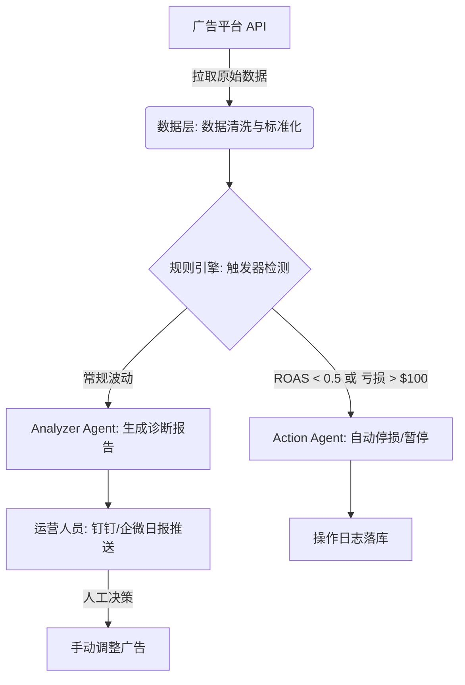
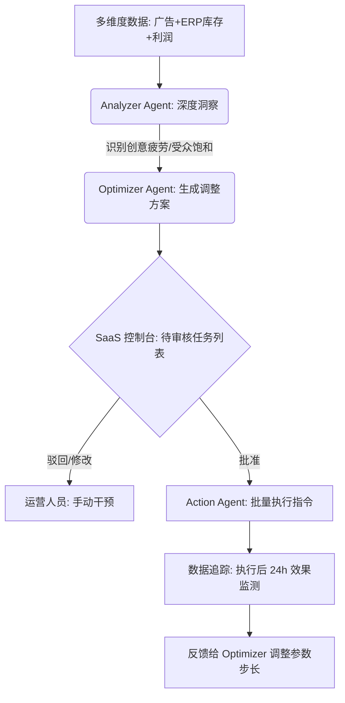
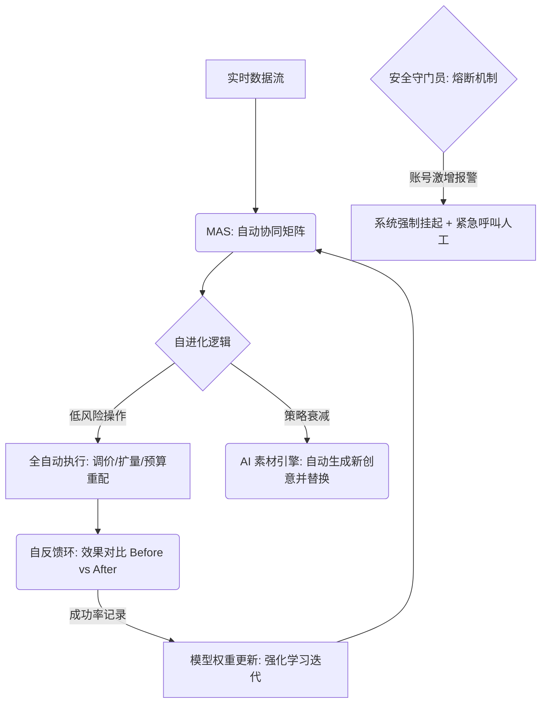

# 目标: 打造AI驱动的跨境SaaS广告“自动赚钱引擎”

**核心定位**: 跨境 SaaS + GEO + 自动化运营。从“数据驱动的功能平台”升级为“利润驱动的自动赚钱引擎”。
**核心愿景**: 减少人工盯盘，把投放变成可规模化系统。最终实现：1人管理10个店 / 1个投手管理100个广告组。
**差异化竞争**: 做“利润驱动”而非“数据驱动”；做“自动执行”而非“辅助建议”；初期聚焦垂直类目、单一国家（GEO）、单平台（如 Meta/Amazon）做到极致自动化。

---

# 一、 系统整体架构 (5层模型)

基于真实商业价值，将系统解耦为五层核心链路：数据层 → 诊断层 → 决策层 → 执行层 → 反馈学习层。

## 1. 数据层 (Data Layer) - 利润驱动的基石
接入多平台API（Meta, Google Ads, TikTok Ads, Shopify, Amazon等），实时拉取核心数据。
- **全链路指标接入**: 曝光(Impressions)、点击率(CTR)、单次点击转化(CPC)、千次展示(CPM)、转化率(CVR)、客单价(AOV)。
- **实时模型构建**:
  - **产品利润模型**: 真实利润 = (ROAS × 毛利率) - 广告费 - 退款率 - 履约成本。
  - **渠道转化模型**: 评估不同流量来源的实际效率。
  - **广告账户健康模型**: 监控账户权重与生命周期。

## 2. 诊断层 (AI诊断大脑) - 系统的心脏
对广告现状进行智能切片与定性分析。
- **模块A：广告健康诊断**: 自动识别学习期未完成、创意疲劳、受众饱和、预算受限、竞价过高、归因偏差等异常状态。
- **模块B：利润诊断模型**: 基于利润算式，由AI直接判定该广告组接下来的命运：是继续放量、需要降本，还是立即停掉止损。

## 3. 决策层 (MAS策略引擎) - 商业价值核心
基于诊断结论，执行高维度的商业决策。
- **策略模型1：预算动态分配与停损**: 
  - 规则版: ROAS超目标20%则预算+30%；ROAS低于目标则预算-20%；连续3天亏损则强行自动暂停。
  - 高阶版 (强化学习/多臂老虎机/贝叶斯): AI模型在此基础自主试探与回撤，自动寻找最佳预算组合池。
- **策略模型2：自动出价调优 (Auto-Bidding)**: 根据时间段转化热度、不同国家/地区(GEO)的表现分化、细分人群和设备表现，作细颗粒度的动态出价。
- **策略模型3：自动扩量与裂变 (Scaling)**: 当产品进入稳定盈利态势，自动复制优质广告组、自动拓展Lookalike受众、自动切Broad宽定向、甚至自动测试新国家(GEO)市场。

## 4. 创意自动生成系统 (AI素材引擎) - 破局点
广告效能的上限在于素材，系统将内置从文案到视频的工业化生产流水线支持跨境多语言。
- **文案自动生成**: 爬取并分析亚马逊等平台的评论(Review)痛点与竞品素材，提取情绪标签。一键生成：冷启动文案、转化型文案、紧迫感倒计时文案、UGC风格剧本。
- **短视频自动生成**: 结合模板视频、AI虚拟人讲解、自动生成多语种字幕（英语、德语、西语、阿语等），实现素材秒级裂变。

## 5. 反馈学习系统 (自进化机制)
系统随时间推移变得更聪明，构建技术壁垒。
- **每日迭代**: 自动更新“创意评分模型”、“用户响应标签库”、“受众兴趣权重”和“转化预测模型”。
- **模型私有化**: 最终为不同客户沉淀出独属于他们的：店铺专属模型、垂直类目专属模型以及特定国家(GEO)专属模型。

---

# 二、 SaaS产品结构与功能拆解

## 1. 前台展现层 (UI)
- 实时利润看板 (不只是看ROAS，直接看净利)。
- 广告异常全天候预警台。
- 自动化履历 (列出自动放量、自动停损的执行记录流水)。
- 创意效果排行榜与ROI预测曲线。

## 2. 后台算法引擎层
构建5大核心预测与检测模型：
1. 账户层强化学习预估模型
2. 创意表现生命周期预测模型
3. 国家(GEO)多维利润预测模型
4. 产品生命周期衰减预警模型
5. 广告素材视觉严重疲劳检测模型

---

# 三、 系统分阶段落地版本规划 (Roadmap)

### 🥉 V1：核心闭环与单点突破 (30天可上线MVP)
- **目标**: 证明核心逻辑跑通，适合当前现有跨境SaaS的切入。
- **功能**:
  - API数据拉取与清洗集成。
  - 跑通基于硬规则引擎的自动调整预算与出价。
  - 核心痛点：可靠的**自动停损功能**上线。
  - 基础的创意评分模型。

### 🥈 V2：AI全面接管与扩量
- **功能**:
  - 引入强化学习动态预算分配。
  - 上线自动扩量(Scaling)与受众裂变系统。
  - 接入“AI创意自动生成引擎” (文案+视频模板化)。
  - 深度利润预测看板。

### 🥇 V3：多核、跨国与全渠道生态
- **功能**:
  - 多平台统一跨平台投放分配预算 (Meta + Google + Amazon 联动)。
  - 自动跨国(GEO)市场测试与成功经验迁移。
  - 自建独立归因模型，打通私域(CRM)数据深度洗盘。

---

# 四、 商业模式设计 (SaaS变现)

摆脱单纯卖软件的内卷，与卖家利益深度绑定：
1. **基础消耗抽佣**: 收取全盘广告消耗 1% - 3% 的服务费。
2. **高端利润分成**: 不收月费，只针对经过系统优化后产生的**增量盈利部分**抽取 10% - 20%。
3. **阶梯式SaaS订阅**: 分为基础规则版、高级AI版、独占算力版，定价矩阵如 $199 / $499 / $999 每月。


---


# 四、 系统演进流程图

### 1. 阶段一：辅助诊断与规则停损流程 (M1)
**核心**: 人工为主，系统负责数据清洗与基于阈值的自动化预警/止损。



---

### 2. 阶段二：智能副驾与人机协作闭环 (M2)
**核心**: AI 深入参与分析与方案建议，人工负责最后一道“一键审批”关口。



---

### 3. 阶段三：全自动托管与自进化流程 (M3)
**核心**: AI 完全闭环，人类作为“安全官”仅参与熔断预警与高价值策略设计。



---

# 附录：MAS Agent 详细能力规划参考 (从技术架构级实现角度)


以下内容作为系统底层 Agent 协作的具体实现参考，用于指导研发侧进行 MCP Tools 封装与 Agent 提示词工程：

## 1. 数据分析专家 (Analyzer Agent)
- **核心职能**: 定时读取数据，多维交叉分析，寻找“因果关系”。
- **能力要求 (Tools/Skills)**:
  - 读取广告全层级报表 (Campaign, AdGroup, Keyword, SearchTerm)。
  - 接入库容与 ROI 利润表（防断货、防亏损）。
- **分析逻辑**: 自动计算当日与昨日、上周同期对比。识别 CTR 突降（素材问题？）、CVR 突降（落地页或竞争对手改价？）、CPC 飙升（市场竞争激烈？）等异常。

## 2. 优化策略师 (Optimizer Agent)
- **核心职能**: 将诊断结论转化为具体的调整参数（Action Intent）。
- **能力要求 (Tools/Skills)**:
  - 策略匹配引擎：根据产品生命周期（新品/爆品/清货）匹配 Prompt 指令集。
  - 参数预估模型：计算如果竞价下调 0.1，对流量影响的概率分布。
- **决策产出**: 生成标准指令集（如：`UPDATE bid SET val=1.2 WHERE group_id=123`），并附带决策依据说明。

## 3. 执行专员 (Action Agent)
- **核心职能**: 确保指令 100% 正确执行及异常上报。
- **能力要求 (Tools/Skills)**:
  - 调用各平台 Ads API。
  - 执行前置校验：检查修改后的竞价是否超出账户设定的最高保护价（安全熔断）。
  - 处理 Rate Limit (限流状态下的指数重退避算法)。
- **监控记录**: 记录每次操作的 Request ID 与执行后的状态回填。

## 4. 调度总控室 (Router/Monitor Agent)
- **核心职能**: 统筹 Agent 协作流与人机交互。
- **能力要求 (Tools/Skills)**:
  - 任务编排引擎 (State Machine)：管理“分析->决策->审核->执行”的生命周期。
  - 预警通知模块：对接企微、邮件、钉钉推送，处理 User Approval 回调。
- **管理看板**: 提供 Agent 消耗的 Token 成本管理、运行效率监控以及人工审核台面。

---

## 5. MAS 系统深度技术架构 (参考 OpenClaw 设计)

为了支撑跨境电商高并发及复杂决策的需求，MAS 系统采用类似 OpenClaw 的“网关与运行时”分离架构：

### A. 整体架构：控制面与执行面分离
- **Claw Gateway (控制面)**: 
  - 作为中央调度器，负责 Session (会话) 状态管理、用户输入/输出通道的统一分发（如 WebSocket、Web UI、Webhook）。
  - **Context Assembly (上下文组装)**: 在向智能体下达指令前，从元数据中心、历史记录和 Skills 注册中心组装完整的 Context Package。
- **Agent Runtime (执行面)**: 
  - 核心互动发生地，采用 RPC 风格调用，支持 Response 流式传输。
  - 负责维护 Agent 的基准 Prompt、可用 Skills 清单以及 Bootstrap 配置文件。

### B. 核心设计原则
- **ReAct 循环 (Reasoning + Acting)**:
  - Agent 不仅生成文本，而是遵循“思考 -> 行动 -> 观察 -> 下一步”的持续循环（直到目标达成）。
- **双层存储体系 (Dual Memory)**:
  - **短期记忆 (Working Memory)**: 基于会话生命周期的 Context Window 映射，存储当前任务的对话链。
  - **长期记忆 (Persistent Knowledge)**: 结合向量数据库 (Vector DB)，持久化行业策略库、GEO 特定经验和品牌私有数据，支持语义化检索。
- **工具隔离与沙盒化 (Tool Sandboxing)**:
  - 每一个 Write Skill (如 API 调用修改竞价) 均在受控环境下执行，具备严格的权限校验 (Capability Tokens) 和参数合法性检查。

### C. 会话隔离与串行执行
- **Lane (执行轨道) 隔离**: 每个账号或每个特定任务（如“SKU A 的调价任务”）独占一个执行 Lane，防止竞态条件和决策冲突。
- **状态持久化**: Agent 的思考状态与执行节点实时同步至 JSONL/JSON 格式，确保系统崩溃后可无缝从断点恢复任务流。

### D. 心跳监控与 Cron 调度 (自修复能力)
为了保证自动化任务的鲁棒性，系统引入实时监控与故障恢复机制：
- **心跳机制 (Heartbeat)**: 
  - 所有运行中的 Agent 实例需每 5-10 秒向 Redis 状态中心发送心跳包。
  - **Watchdog (守护进程)**: 实时扫描心跳注册表，若某个实例心跳超时（如 >30s），立即标记该任务为 `Zombie (僵死)` 状态。
- **分布式 Cron 调度**:
  - 采用 **Temporal** 或 **Quartz** 维护分布式的定时任务，驱动“分析-诊断-执行”的周期性循环。
- **唤起与重试 (Self-Healing)**:
  - 监控系统检测到僵死任务后，自动根据持久化的状态快照重新拉起新的 Worker 执行。
  - 对于 API 调用失败的任务，采用指数退避(Exponential Backoff)策略进行自动重试。

### E. Agent Runtime 技术选型 (多语言支持)

为了兼顾高并发处理（Go）、业务逻辑复用（Java）以及 AI 生态集成（Python），推荐以下多语言支持的开源框架组合：

- **核心架构抽象: Google Agent Development Kit (ADK)**:
  - **优势**: 官方支持 **Python, TypeScript, Go, 和 Java**。
  - **特点**: 提供统一的 Agent 编排抽象，支持工具调用、内存管理和多 Agent 协同，非常适合本系统的多语言异构需求。
- **工作流与状态机: Temporal.io (推荐)**:
  - **SDK 支持**: **Go, Java, Python**, PHP, TypeScript。
  - **职责**: 充当 Agent 的“耐用运行时”，处理心跳监控、超时重试、状态快照和分布式 Cron。它是解决“僵死任务”最好的工业级选型。
- **应用层选型建议**:
  - **Java 侧**: 使用 **LangChain4j** 或 **Spring AI** 对接企业级业务。
  - **Python 侧**: 使用 **LangChain** 或 **AutoGPT/CrewAI** 进行算法实验与素材生成。
  - **通讯协议**: 统一使用 **gRPC** (Protobuf 定义) 实现跨语言的服务调用与数据交换。
- **存储选型**: **PostgreSQL** (业务元数据) + **Redis** (缓存与心跳) + **Chroma/Milvus** (向量库用于长期记忆)。

### F. Agent Runtime 执行逻辑流程图

```mermaid
graph TD
    A[任务触发: Cron或用户手动] --> B[Claw Gateway: 权限与Session校验]
    B --> C[Context Assembly: 组装Prompt/记忆/Tools]
    C --> D[Agent Runtime: 启动 ReAct 循环]
    D --> E{LLM 决策: 下一步行动?}
    E -->|调用工具| F[Tool Execution: 安全沙盒执行]
    F -->|反馈结果| G[Observation: 观察环境变化]
    G --> D
    E -->|任务终结| H[Status Update: 更新任务状态与日志]
    H --> I[Notify User: 结果推送至前端/企微]
    
    SubGraph 监控层
        M[Heartbeat Server] -.->|监控状态| D
        M -.->|超时| N[Watchdog: 异常唤起/重试]
        N -.-> D
    end
```


