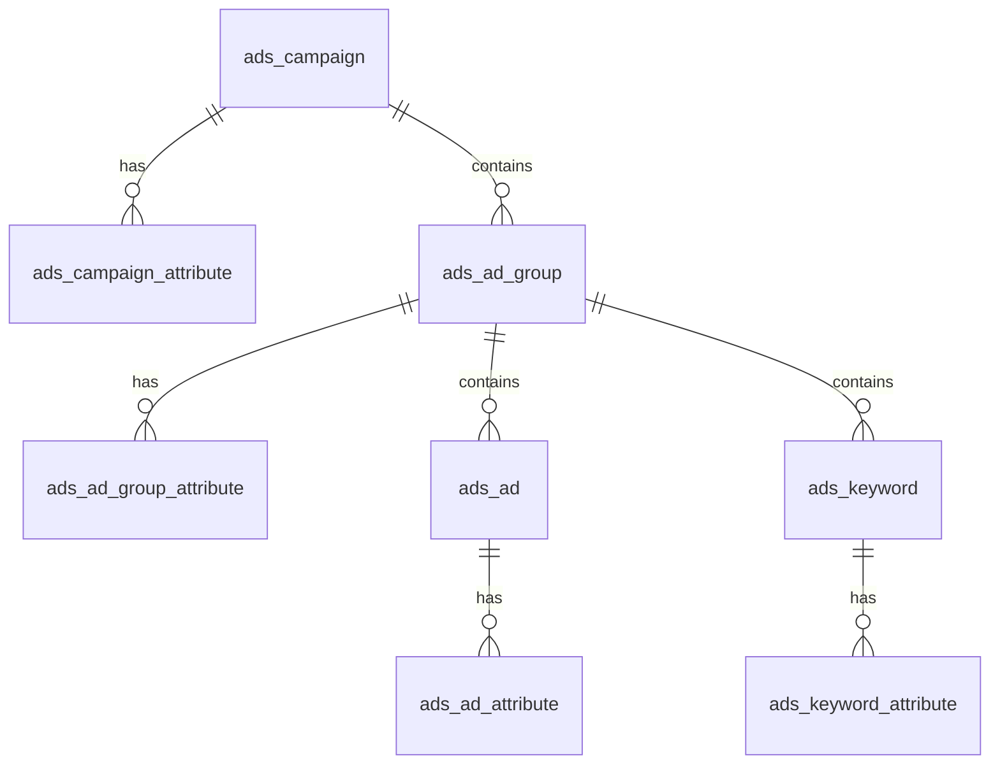

# 广告管理系统架构分析文档

## 1. 核心设计理念
本系统采用“**统一入口、统一存储、差异化实现**”的设计架构，旨在兼容多个跨境电商平台（如亚马逊、TikTok 等）的广告管理需求，同时保持核心业务逻辑的简洁和一致性。

## 2. 数据架构 (Data Architecture)

### 2.1 统一存储与底层设计
系统采用统一的数据库表结构存储各平台的广告实体数据。为了处理不同平台间的字段差异，引入了“属性表”机制。

*   **基础实体表**: 存储各平台通用的核心字段（如名称、状态、预算等）。
    *   `ads_campaign`: 广告活动/计划
    *   `ads_ad_group`: 广告组
    *   `ads_ad`: 广告/素材
    *   `ads_keyword`: 关键词
*   **属性扩展表**: 存储平台特有的非通用字段，以 JSON 格式保存。
    *   `ads_campaign_attribute`
    *   `ads_ad_group_attribute`
    *   `ads_ad_attribute`
    *   `ads_keyword_attribute`

### 2.2 数据关联关系

## 3. 后端架构 (Backend Architecture)

### 3.1 统一操作入口
所有的管理后台请求通过统一的 Controller 进入，位于 `hzapp-module-erplus-adv` 模块：
*   **包路径**: `com.hzltd.module.erplus.adv.metadata.controller.admin`
*   **主要职责**: 处理通用的 CRUD 请求、分页查询、状态更新和预算调整。

### 3.2 平台差异化实现接口 (API Layer)
各平台的具体实现继承自 `hzapp-module-erplus-api` 中定义的通用接口：
*   **接口定义**: `com.hzltd.module.erplus.adv.service.AdsManagerApi`
*   **主要方法**: `queryCampaign`, `updateCampaign`, `updateStatus`, `updateBudget`, `updateBid` 等。

### 3.3 平台特有逻辑实现 (Platform Modules)
特定平台的业务逻辑在各自的模块中实现（例如 `amz` 模块）：
*   **Amazon 实现类**: `com.hzltd.module.amz.adv.api.AdsAmazonManageApi`
*   **内部调用流**: `AdsAmazonManageApi` -> `AdsCampaignMangerApi` / `AdsAdGroupManagerApi` -> Amazon SP-API Client。
*   **特有接口**: 平台可以定义仅供特定前端组件调用的专有 Controller 接口，用于处理平台特有的复杂配置（如 Amazon 的竞价策略）。

## 4. 前端架构 (Frontend Architecture)

### 4.1 统一操作 UI
*   **列表页**: 提供通用的广告活动、广告组、广告、关键词列表展示（如 `AdCampaignList.vue`）。
*   **通用操作**: 支持通用的状态切换、预算修改等快捷操作。

### 4.2 个性化配置页面
*   **详情页操作**: 在广告活动详情页中，根据所属平台加载对应的 `{平台}配置页面`。
*   **动态加载**: 通过平台标识动态渲染组件，以处理各平台特有的配置需求（如 Amazon 的分时调价、动态竞价设置等）。

## 5. 关键组件对照表

| 层次 | 核心类/路径 | 说明 |
| :--- | :--- | :--- |
| **Controller (统一)** | `AdsCampaignController` | 位于 `erplus-adv` 模块，处理通用请求 |
| **Service (统一)** | `AdsCampaignService` | 位于 `erplus-adv` 模块，管理本地数据与同步逻辑 |
| **API (接口定义)** | `AdsManagerApi` | 位于 `erplus-api` 模块，定义跨平台操作标准 |
| **API (Amazon 实现)** | `AdsAmazonManageApi` | 位于 `amz-biz` 模块，实现亚马逊特有对接逻辑 |
| **Data Object** | `AdsCampaignDO` | 统一的广告活动数据模型 |
| **Attribute DO** | `AdsCampaignAttributeDO` | 平台特有属性的 KV 存储模型 |
