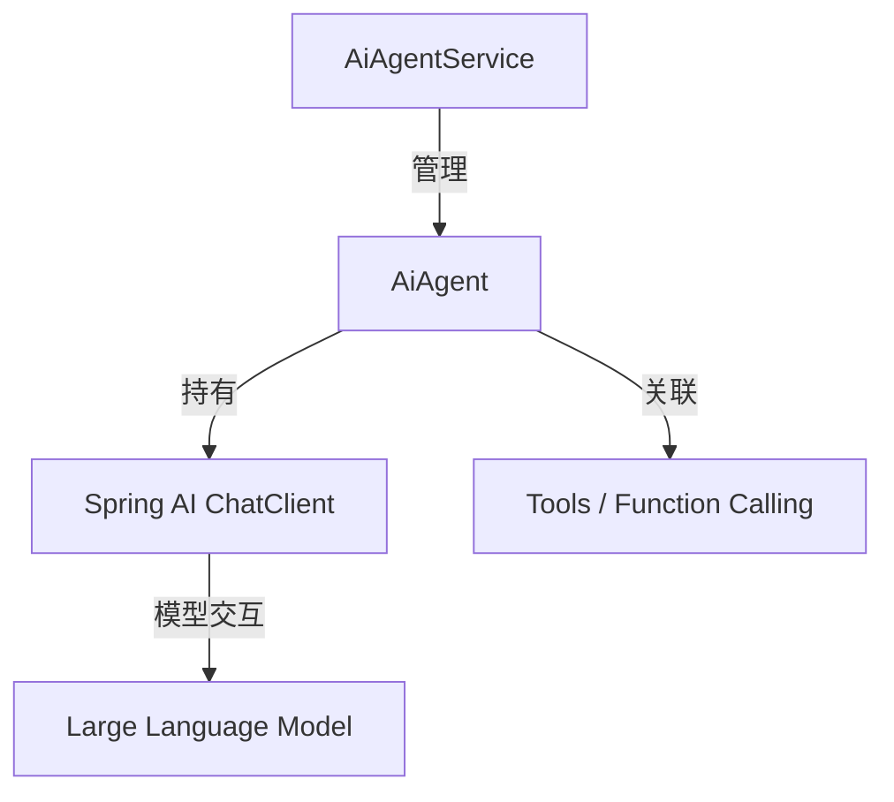

# AI Module (hzapp-module-erplus-ai)

## 模块概述
`hzapp-module-erplus-ai` 是基于 `spring-ai-alibaba` 构建的 AI 能力核心模块。它提供了一个轻量级的 AI Agent 编排引擎，支持 Agent 的注册、发现和执行，并集成了国产大模型（通义千问等）的调用能力。

## 架构设计
本模块采用分层编排架构，主要分为 **编排层 (Orchestration)**、**智能体层 (Agent)**、**工具层 (Tool)** 和 **基础配置层 (Config)**。

### 1. 分层设计
- **`config` (基础配置层)**: 负责 AI 相关的配置初始化，如 `ChatClient` 的 Bean 定义、组件扫描等。
- **`core.service` (编排层)**: 核心服务层。`AiAgentService` 作为管理中心，负责所有 AI Agent 的声明式注册和统一调用入口。
- **`core.agent` (智能体层)**: 定义了 `AiAgent` 接口及基础实现类 `BaseAiAgent`。具体的业务 Agent（如 `GeneralAssistantAgent`）通过继承并声明自己的 System Prompt 和所需 Tool 来实现具体功能。
- **`core.tool` (工具层)**: 基于 Spring AI 的 Function Calling 机制，将外部能力（如查询日期、数据库搜索等）封装为可供大模型调用的工具函数。
- **`core.model` (数据模型层)**: 统一定义 AI 请求 (`AiAgentRequest`) 和响应 (`AiAgentResponse`) 的数据结构。

### 2. 核心组件关系

## 模块组成
| 包路径 | 说明 | 关键类 |
| --- | --- | --- |
| `config` | 配置中心 | `AiConfiguration` |
| `core.agent` | 智能体定义 | `AiAgent`, `BaseAiAgent`, `GeneralAssistantAgent` |
| `core.service` | 编排服务 | `AiAgentService` |
| `core.tool` | 工具集成 | `DateTimeTool` |
| `core.model` | 对象模型 | `AiAgentRequest`, `AiAgentResponse` |

## 开发指南

### 如何添加一个新的 Agent
1. **创建 Agent 类**: 继承 `BaseAiAgent`。
2. **定义提示词**: 实现 `getSystemPrompt()` 方法，定义智能体的角色和任务。
3. **注入工具 (可选)**: 在构造函数中指定该 Agent 需要使用的 Tool 名称（对应 Spring Bean 里的 Function 名称）。
4. **自动注册**: 将该类标注为 `@Component`，`AiAgentService` 会在启动时自动扫描并注册该 Agent。

### 如何添加一个新的 Tool
1. **编写工具类**: 创建一个带有 `@Configuration` 的类。
2. **定义子 Bean**: 使用 `@Bean` 返回一个 `java.util.function.Function`。
3. **添加描述**: 使用 `@Description` 注解详细描述该函数的功能，以便 LLM 正确理解如何调用。

## 未来迭代方向
- **RAG 支持**: 引入弹性的向量数据库集成，支持知识库检索增强。
- **多轮对话管理**: 引入上下文持久化机制，支持复杂的对话链条。
- **Agent 流式输出**: 优化执行接口，全面支持 Server-Sent Events (SSE) 流式响应。
