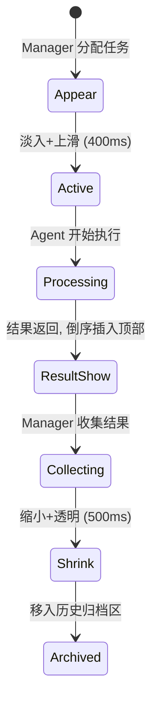

# MAS 多智能体执行结果 UI 设计方案

## 核心设计理念

**"Manager 全局视图 + Agent 卡片式工作台"** — Manager 作为总控展示全局进度流程图，每个 Agent 是独立的实时工作卡片，任务完成后卡片动画收缩至 Manager 的流程节点中。

---

## 整体布局

```
┌───────────────────────────────────────────────────────────┐
│  EntropyFlow MAS                      [历史] [新任务]      │
├────────────────────────────┬──────────────────────────────┤
│                            │                              │
│  ① Manager 全局流程视图     │     交互对话 (Chat)           │
│  ┌──────────────────────┐  │     ┌──────────────────────┐ │
│  │ Stepper 流程进度      │  │     │                      │ │
│  │ INIT → PLAN → EXEC   │  │     │   对话消息列表         │ │
│  │ + Manager 决策摘要    │  │     │                      │ │
│  └──────────────────────┘  │     │                      │ │
│                            │     │                      │ │
│  ② Agent 实时工作卡片       │     │                      │ │
│  ┌─────────┐ ┌─────────┐  │     │                      │ │
│  │  PM     │ │ Executor│  │     ├──────────────────────┤ │
│  │  Card   │ │  Card   │  │     │   输入框              │ │
│  └─────────┘ └─────────┘  │     └──────────────────────┘ │
│                            │                              │
│  ③ 历史归档 (折叠)          │                              │
│  ▸ 已完成任务 (3)          │                              │
└────────────────────────────┴──────────────────────────────┘
```

左侧 **55%**，右侧 **45%**。左侧从上到下三层：全局流程 → 活跃卡片 → 归档折叠。

---

## ① Manager 全局流程视图

横向 Stepper 展示状态机流转，实时高亮当前阶段：

```
  ●───────→ ●───────→ ○───────→ ○───────→ ○
 INIT      PLANNING   EXECUTING  REVIEWING  COMPLETED
 ✓ 完成    🔵 进行中    ◇ 待执行    ◇ 待执行    ◇ 待执行

 💬 最新决策: "已确定 PM + Executor 参与，进入任务规划阶段"
```

**交互**：
- 当前活跃节点带 `pulse` 动画
- 已完成节点绿色 ✓，失败红色 ✗
- 每个节点可点击展开该阶段的 Manager 决策详情
- 底部一行显示 Manager 最新决策摘要（截断 + 点击展开）

**数据来源**：`MasSession.status` + `MasTaskHistory` 中 `role=MANAGER & isInternal=true` 的最新 `result`

---

## ② Agent 实时工作卡片

### 布局
水平排列，每个活跃 Agent 一张卡片，只显示正在执行或刚完成的任务：

```
┌─ PM ────────────────┐  ┌─ Executor ──────────┐
│ 🔵 任务规划与拆解     │  │ 🟢 关键词分析         │
│                     │  │                     │
│ ▼ 最新结果 (倒序)    │  │ ▼ 最新结果 (倒序)     │
│ ┌─────────────────┐ │  │ ┌───────────────┐   │
│ │ 执行中... 🔄     │ │  │ │ 正在处理... 🔄 │   │
│ │ prompt: xxx     │ │  │ │ [进度占位]     │   │
│ └─────────────────┘ │  │ └───────────────┘   │
│ ┌─────────────────┐ │  │                     │
│ │ ✅ 上一轮结果    │ │  │                     │
│ │ result: ...     │ │  │                     │
│ └─────────────────┘ │  │                     │
│                     │  │                     │
│ 📊 进度 1/3        │  │ 📊 进度 0/5          │
└─────────────────────┘  └─────────────────────┘
```

### 卡片内部结构

```
┌─ [角色图标] [Agent 名称] ───── [状态标签] ─┐
│                                           │
│  当前任务: 任务规划与拆解                     │
│                                           │
│  ┌─ 📝 Thought/Prompt ────── [折叠] ──┐  │
│  │ xxx...                              │  │
│  └─────────────────────────────────────┘  │
│                                           │
│  ┌─ 💡 最新结果 ─────────────── new! ──┐  │  ← 倒序，最新在上
│  │ {结果内容, JSON 格式化展示}           │  │
│  │ ⏱️ 1.2s                             │  │
│  └─────────────────────────────────────┘  │
│                                           │
│  ┌─ ✅ 历史结果 ────────────── [折叠] ──┐  │  ← 默认折叠
│  │ ...                                 │  │
│  └─────────────────────────────────────┘  │
│                                           │
│  ──────────── 📊 进度 1/3 ───────────── │
└───────────────────────────────────────────┘
```

### 卡片生命周期



**关键动画**：

| 事件 | 动画效果 | 时长 |
|------|---------|------|
| 新卡片出现 | 底部滑入 + scale(0.95→1) | 400ms |
| 执行中 | 卡片头部 pulse 指示器 | 持续 |
| 结果返回 | 倒序从顶部淡入插入 | 300ms |
| 自动定位 | scrollTo top（因为倒序，最新在上） | smooth |
| Manager 收集 | 结果摘要飞向流程图节点 | 500ms |
| 卡片销毁 | scale(1→0.9) + opacity(1→0) | 300ms |
| 归入归档 | 归档区 badge 数字 +1 | 200ms |

---

## ③ 历史归档区

折叠显示在左侧底部，点击展开：

```
▸ 已完成任务 (3)
  ┌──────────────────────────────────────┐
  │ ✅ PM: 任务规划与拆解        ⏱ 2.1s  │
  │ ✅ Executor: 关键词分析      ⏱ 5.3s  │
  │ ✅ Executor: 竞品调研        ⏱ 8.7s  │  ← 点击可展开详情
  └──────────────────────────────────────┘
```

---

## 数据流与轮询策略

```
前端轮询 (每 3s)
  │
  ├─ GET /session/get       → 更新 Manager 流程状态
  │
  └─ GET /task-history/list → 按 role 分组
       │
       ├─ MANAGER (isInternal) → 更新流程图决策摘要
       ├─ PM (非 internal)     → 更新 PM 卡片
       └─ EXECUTOR (非 internal)→ 更新 Executor 卡片
       │
       └─ 与上次结果 diff 对比
           ├─ 新增 → 触发卡片出现/结果插入动画
           └─ 状态变更 → 触发收缩/销毁动画
```

---

## 前端类型扩展

```typescript
/** Agent 工作卡片 */
interface AgentWorkCard {
  role: string                    // MANAGER/PM/EXECUTOR
  agentName: string
  status: 'idle' | 'working' | 'done'
  currentTask?: MasTaskHistory
  recentResults: MasTaskHistory[] // 倒序
  totalTasks: number
  completedTasks: number
}

/** Manager 流程节点 */
interface FlowNode {
  state: string
  label: string
  status: 'completed' | 'active' | 'pending' | 'failed'
  decision?: string
  timestamp?: string
}
```

## 后端适配

`MasTaskHistoryRespVO` 需暴露 `isInternal` 字段，前端需要用它区分 Manager 内部决策和可见的业务任务。

---

## 组件拆分

```
index.vue                        # 主页面 (布局+数据编排)
├── MasManagerFlow.vue           # ① Manager 流程进度条
├── MasAgentCardContainer.vue    # ② Agent 工作卡片容器
│   └── MasAgentCard.vue         #    单个 Agent 工作卡片
│       └── MasTaskResultItem.vue#    单条任务结果(倒序)
├── MasArchivedTasks.vue         # ③ 历史归档折叠区
├── MasChat.vue                  # 交互对话 (已有)
└── MasHistoryDrawer.vue         # 历史会话抽屉 (已有)
```
