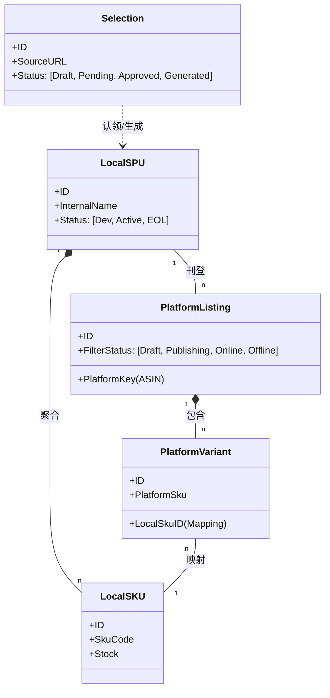
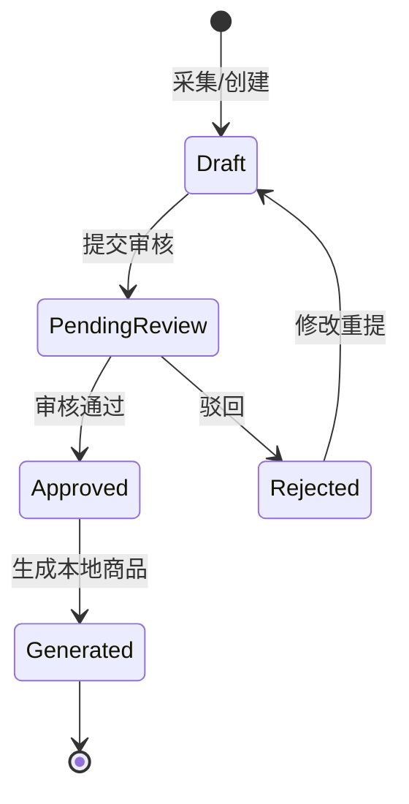
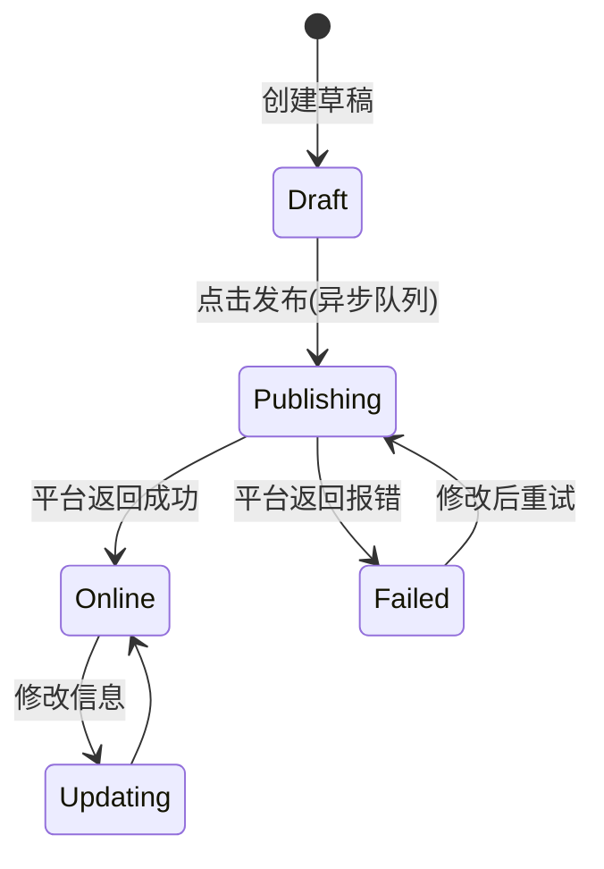

# 跨境电商商品层级模型设计文档 (V4)

## 1. 设计目标 (Goals)

1.  **统一管理 (Centralized Management)**: 以“本地商品”为核心主数据，屏蔽不同平台的结构差异。
2.  **灵活适配 (Flexible Adaptation)**: 兼容 Amazon (变体/ASIN), Ozon (SKU卡片), TikTok (SPU-SKU) 等不同平台的商品结构。
3.  **高效刊登与监控 (Efficient Listing & Monitoring)**: 支持一键多平台发布，以及针对不同层级（Listing级或SKU级）的销量、价格、库存监控。

## 2. 核心层级模型 (Core Hierarchy)

模型分为三层：**选品层** -> **本地主数据层** -> **平台渠道层**。



---

### 2.1 选品管理 (Selection Layer)

- **定位**: 新品开发的“蓄水池”。
- **关键数据**: 来源链接、成本估算、参考图。

### 2.2 本地商品管理 (Local Product Master)

- **Local SPU**: 标准产品单元 (如 "运动水壶")。
- **Local SKU**: 物理库存单元 (如 "运动水壶-蓝-500ml")。**这是库存和成本核算的基石。**

### 2.3 跨境平台商品 (Platform Channel Layer)

- **Platform Listing**: 刊登主体 (Amazon Parent ASIN, Ozon Card)。
- **Platform Variant**: 售卖变体 (Amazon Child ASIN, TikTok SKU)。
- **特性**: 必须包含与 `Local SKU` 的映射关系。

---

## 3. 核心业务流程详解 (Detailed Workflows)

### 3.1 场景一：选品认领到本地商品 (Selection -> Local Product)

**流程描述**: 开发人员提交选品 -> 经理审核 -> 审核通过 -> 自动/手动转为本地正式商品。

**数据变化**:

1.  **提交**: `Selection` 创建，状态 `DRAFT` -> `PENDING_REVIEW`。
2.  **审核通过**: 经理审批，状态 `PENDING_REVIEW` -> `APPROVED`。
3.  **生成商品**:
    - 系统读取 `Selection` (ID: 101) 信息。
    - 创建 `ProductSpuDO` (ID: 201)，复制图片、名称、分类。
    - 创建 `ProductSkuDO` (ID: 20101)，生成初始 SKU 编码 (如 `NEW-001`)。
    - 回写 `Selection`，设置 `ref_spu_id = 201`，状态 -> `GENERATED` (已生成)。

**状态机 (Selection Status)**:



---

### 3.2 场景二：本地商品多平台刊登 (Publishing)

**流程描述**: 运营选择本地商品 -> 选择平台/店铺 -> 配置差异化信息 -> 推送发布。

**数据变化**:

1.  **初始化刊登**:
    - 源: `LocalSpu` (ID: 201, 含 SKU: Red, Blue)。
    - 目标: Amazon US 店铺。
    - 生成: `PlatformListing` (ID: 500, 状态 `DRAFT`)。
    - 生成: `PlatformVariant` (ID: 501, 502), 自动关联 `LocalSku` (Red, Blue)。
2.  **编辑草稿**: 运营修改 `PlatformListing` 的标题 (英文), 价格 (USD)。
3.  **执行刊登**: 点击“发布”。包含三个子步骤：
    - **上传基本信息**: 调用平台 `createProduct` API。
    - **上传图片**: 调用 `uploadImage` API。
    - **更新库存/价格**: 调用 `updateInventory` API。
4.  **结果回写**:
    - **成功**: 状态 `DRAFT` -> `ONLINE`，回填 `platform_key` (如 ASIN)。
    - **失败**: 状态 `DRAFT` -> `PUBLISH_FAILED`，记录错误信息 (如 "Title too long")。

**状态机 (Listing Publish Status)**:



---

### 3.3 场景三：以本地商品为核心的监控 (Centralized Monitoring)

**流程描述**: 聚合各平台的销售数据，为供应链决策提供依据。

**数据流转**:

1.  **定时抓取**: 系统每日拉取各店铺 Order/Report。
2.  **数据清洗**:
    - Amazon 卖出 1个 `Child ASIN: B001` (关联 `Local SKU: Red`)。
    - TikTok 卖出 2个 `Sku ID: T001` (关联 `Local SKU: Red`)。
3.  **聚合计算**:
    - `Local SKU: Red` 当日总销量 = 1 (Amz) + 2 (TK) = 3。
    - `Local SPU` 当日总销量 = Sum(所有SKU销量)。
4.  **展示**: 在【本地商品列表】可以看到该商品在所有平台的累计表现。

---

### 3.4 场景四：库存联动 (Inventory Synchronization)

涉及 **本地库存 (真实库存)** 与 **平台库存 (销售库存)** 的交互。

**A. 线下入库导致平台库存增加**:

1.  **入库**: 采购单到货，`Local SKU: Red` 库存 0 -> 100。
2.  **触发同步**: 系统通过 `LocalSkuID` 查找所有关联的 `PlatformVariant`。
    - 找到 Amazon US / Variant A (策略: 同步 100%) -> 推送 100。
    - 找到 Shopee MY / Variant B (策略: 预留 10, 同步 90%) -> 推送 90。
3.  **结果**: 各平台前台库存更新。

**B. 平台出单导致本地库存扣减**:

1.  **产生订单**: Amazon 产生订单，包含 1个 `Variant A`.
2.  **订单下载**: ERP 拉取订单，识别映射到 `Local SKU: Red`.
3.  **库存占用**: `Local SKU: Red` 可用库存 100 -> 99 (预占/锁定)。
4.  **触发再同步 (防止超卖)**:
    - `Local SKU` 变动 -> 再次触发 A 流程。
    - 推送 Shopee MY 库存 -> 99 \* 90% = 89 (更新 Shopee 库存，尽管 Shopee 没出单)。

---

## 4. 数据库设计建议 (Database Schema)

_注：保留并增强 V2 版本定义的结构，确保层级兼容性。_

### 4.1 平台刊登主体 (`erp_platform_listing`)

**定位**: 平台聚合层 (Amazon Parent ASIN, Ozon Item)。

```sql
CREATE TABLE erp_platform_listing (
    id BIGINT PRIMARY KEY COMMENT '主键ID',
    shop_id BIGINT COMMENT '关联店铺ID',
    platform_code VARCHAR(20) COMMENT '平台编码: AMAZON, OZON, TIKTOK',
    platform_key VARCHAR(100) COMMENT '平台业务主键: ASIN, ProductID',
    type TINYINT COMMENT '结构类型: 10=Parent/SPU, 20=Standalone/Single',
    local_spu_id BIGINT COMMENT '来源本地SPU ID',
    title VARCHAR(500) COMMENT '刊登标题',
    main_image VARCHAR(500) COMMENT '主图URL',
    sync_status TINYINT COMMENT '同步状态: 0=Success, 1=Pending, 2=Failed',
    create_time DATETIME
);
```

### 4.2 平台售卖变体 (`erp_platform_variant`)

**定位**: 实际交易单元 (Amazon Child ASIN, TikTok SKU)。

```sql
CREATE TABLE erp_platform_variant (
    id BIGINT PRIMARY KEY COMMENT '主键ID',
    listing_id BIGINT COMMENT '关联Listing ID',
    platform_sku VARCHAR(100) COMMENT '平台Seller SKU',
    platform_key VARCHAR(100) COMMENT '平台子ID: Child ASIN, SkuID',
    local_sku_id BIGINT COMMENT '映射核心: 指向本地SKU',
    price DECIMAL(10,2) COMMENT '当前售价',
    stock INT COMMENT '当前平台库存',
    stock_strategy TINYINT DEFAULT 0 COMMENT '库存策略: 0=实时, 1=固定, 2=百分比',
    safety_stock INT DEFAULT 0 COMMENT '安全库存阈值',
    mapping_type TINYINT DEFAULT 0 COMMENT '映射类型: 0=1:1, 1=组合(Kit)',
    sales_status TINYINT COMMENT '售卖状态: 1=Active, 0=Inactive',
    create_time DATETIME
);
```

### 4.3 组合映射表 (`erp_platform_variant_kit`)

**定位**: 解决“1个平台SKU = N个本地SKU”的组合/捆绑销售场景。

```sql
CREATE TABLE erp_platform_variant_kit (
    id BIGINT PRIMARY KEY,
    platform_variant_id BIGINT COMMENT '平台变体ID',
    local_sku_id BIGINT COMMENT '组成部分: 本地SKU ID',
    quantity INT COMMENT '消耗数量'
);
```
